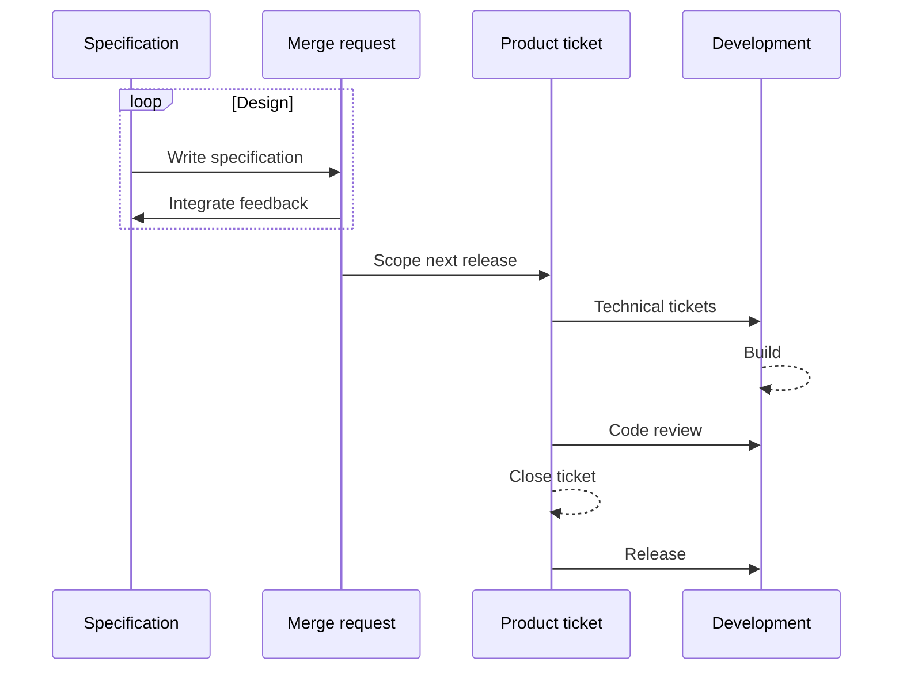

# Vega design
This repository contains specifications and RFCs for future changes to the system. 
- A specification is a large document that details how a portion of the system works
- An RFC will be used in the future to propose changes to specifications. We do not currently use the RFC process

# Specifications
A specification outlines **our best understanding at the moment of how the software should be built**. We want it to be as complete as possible so that when developers are reading a specification they can understand the complete context and future intentions of a component, even if the first developed version is an MVP.

- If a component is being built as a stand-in for a proper implementation, then the MVP should be written as a specification file.

While we are producing the detailed specifications for the Vega trading core, the RFC process (see Notes) would be too heavyweight, so we're starting off by directly editing specifications. When the core specifications are more stable, we will adopt the RFC process.

## The process for a new component
1. Create a new branch
1. Copy `0000-template.md` to `specs/0000-my-feature.md`, (e.g. `specs/0000-example-manager.md`
1. Fill in the details.
1. Submit a merge request to start soliciting feedback. Ensure that the appropriate team members are notified.
1. Build consensus and integrate feedback.
1. Assign a sequence number to your feature, (e.g. `specs/0001-example-manager.md`)
1. Merge

## The *current* process for changes to existing component
1. Create a merge request with a brief description of the changes you need to make
1. Create a branch and start editing the document
1. Build consensus and integrate feedback.
1. Merge to develop

## The specification lifecycle
- When a specification is merged to `master`, it is ready for development.
- Scoping of specifications to releases should be done in product tickets.
- Product tickets should have a defined scope

## Reviewing Specifications
When a pull request is open, this is a request for feedback from the author of the spcification. It is the author's responsibility to solicit feedback from the appropriate development teams or system architects, but anyone is free to browse the open merge requests and pitch in.

# Implementing a specification
When a specification is merged in to master, it is ready for development. The relevant team can then break the specification down in to technical tasks in their own task system.

Issues should be created in the Product issue list to define a particular scope for an upcoming release. The specification should be as complete as it can be, while the issue may be a smaller piece on the way to implementing the first specification.

- Implementation tickets will be handled by the relevant team and linked back to the product tickets
- At the completion of implementation, the product ticket should be closed.
- Future work will be scoped in a new ticket
- Any changes to the specification should be done in new merge requests.

# RFCs
When the core specification is more stable and existing functionality needs to be changed, we will start using an RFC process rather than the specification update outlined above. This will likely mean creating an RFC document in the RFC folder, discussing the merge and then integrating that in to the specifications.

While the specifications are still in major flux. we will make merge requests directly to the specification files for the near future.

# Notes
The workflow for this is partially based on the Rust RFC process: https://github.com/rust-lang/rfcs, adapted for an earlier stage software design process.

It is being adopted as a replacement for using Gitlab issues, which is where past product specifications have beeen written up.
