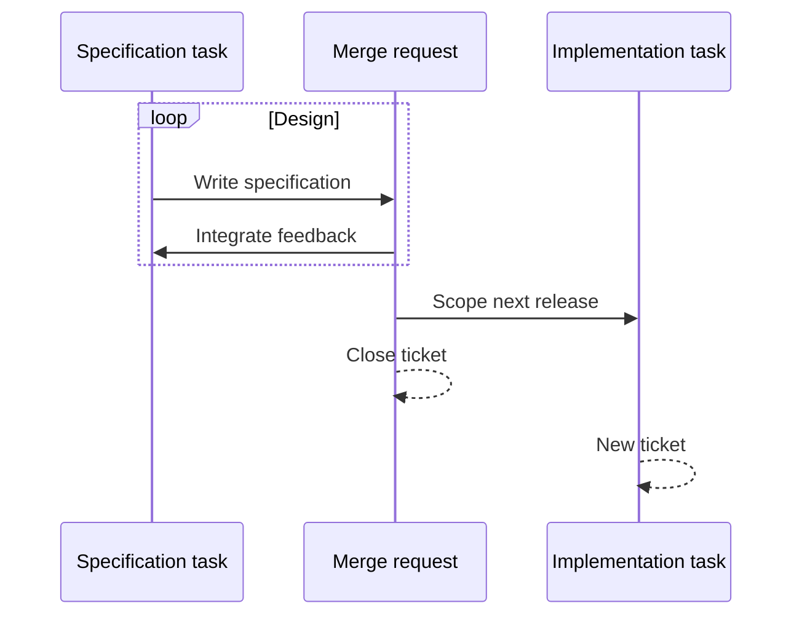
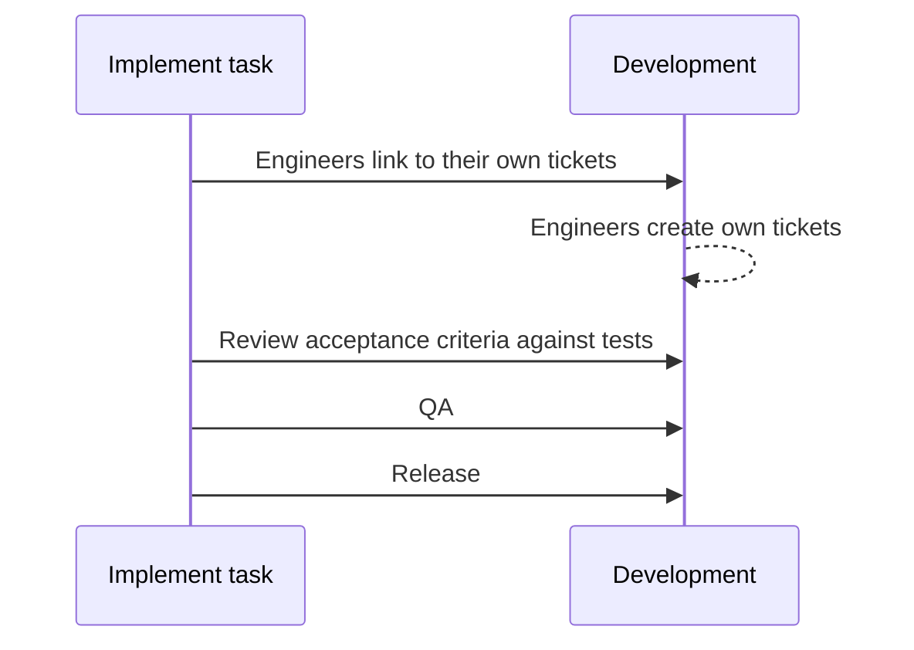

# Vega design
This repository contains specifications and RFCs for future changes to the system. 
- A specification is a large document that details how a portion of the system works
- An RFC will be used in the future to propose changes to specifications. We do not currently use the RFC process

# Specifications
A specification outlines **our best understanding at the moment of how the software should be built**. We want it to be as complete as possible so that when developers are reading a specification they can understand the complete context and future intentions of a component, even if the first developed version is an MVP.

- If a component is being built as a stand-in for a proper implementation, then the MVP should be written as a specification file.

While we are producing the detailed specifications for the Vega trading core, the RFC process (see Notes) would be too heavyweight, so we're starting off by directly editing specifications. When the core specifications are more stable, we will adopt the RFC process.

## Pre-specification analysis
Some specification tasks will first require an analysis phase to investigate alternative ways of specifying the feature. Very early research and development of a feature will happen in the [reseach repo](https://gitlab.com/vega-protocol/papers) and this will be reflected in a published paper in that repo.  The analysis  tickets in the product repo are to initiate and capture any discussion required before proceeding on to writing up the specification file. Analysis tasks should be created when required and all subject matter experts, relevant solution architects and engineers should be notified in the discussion. 

Analysis tasks should be prioritised by those taking the lead on specifying the relevant feature. They may also be prioritised as a result of the engineering OKR goals, coordinated across the team.

## The process for a new component
1. Create a ticket in the [spec-writing board](https://gitlab.com/vega-protocol/product/-/boards/1356823?&label_name[]=TASK%3A%3Aspec-design).
1. When you are ready to commence the spec writing task, move the ticket to a status of _workflow::task-in-progress_.
1. Create a merge request *from the ticket* - this will ensure they are linked and the ticket is automatically closed when merged.
1. Copy `0000-template.md` to `specs/0000-my-feature.md`, (e.g. `specs/0000-example-manager.md`.
1. Fill in the details, including the acceptance criteria.
1. Submit a merge request to start soliciting feedback. Ensure that the appropriate team members are notified.
1. Build consensus and integrate feedback.
1. Assign a sequence number to your feature, (e.g. `specs/0001-example-manager.md`)
1. Merge to master - this will automatically close the associated ticket. 

## The *current* process for changes to existing component
1. Create an ticket in the [spec-writing board](https://gitlab.com/vega-protocol/product/-/boards/1356823?&label_name[]=TASK%3A%3Aspec-design). Label this appropriately, including whether it is a _spec-bug_ or _blocking-code_ and assign to a milestone and individual if appropriate. *Only use the already created labels* (see below for the defined list and raise a merge request against this file if you want to edit these).
1. This ticket will be prioritised by the person it is assigned to, in collaboration with the engineering team.
1. When you are ready to commence the spec writing task, move the ticket to a status of _workflow::task-in-progress_.
1. Create a merge request from this ticket with a brief description of the changes you need to make.
1. Using the automatically created branch, start editing the document. Make sure to edit acceptance criteria if appropriate.
1. Build consensus and integrate feedback.
1. Merge to master - this will automatically close the associated ticket.

## The specification lifecycle
- When a specification is merged to `master`, it is ready for development and if this requires any engineering implementation, a new _implement_ ticket must be created in the [implement board](https://gitlab.com/vega-protocol/product/-/boards/1356766?&label_name[]=TASK%3A%3Aimplement). The person responsible for creating this ticket is the person who has taken the lead on the specification task. See below for further information on implementation lifecycle.
- Scoping of specifications to releases will be done in both _spec-design_ and _implement_ tickets rather than in the specification files.

## Reviewing Specifications
When a pull request is open, this is a request for feedback from the author of the specification. It is the author's responsibility to solicit feedback from the appropriate development teams or system architects, but anyone is free to browse the open merge requests and pitch in.

# Implementing a specification
When a specification is merged to `master`, it is ready for development. Not all specification updates will imply the need for an implementation task (for example, a spec bug). If an implementation task is required, a new _implement_ ticket must be created in the [implement board](https://gitlab.com/vega-protocol/product/-/boards/1356766?&label_name[]=TASK%3A%3Aimplement). The person responsible for creating this ticket is the person who has taken the lead on the specification task, in collaboration  with the engineering team. 

These issues will be prioritised on a weekly basis through a collaborative Slack meeting.

The relevant team can then break the specification down in to technical tasks in their own task system.

Issues should be created in the Product issue list to define a particular scope for an upcoming release. The specification should be as complete as it can be, while the issue may be a smaller piece on the way to implementing the first specification.

- Implementation tickets will be handled by the relevant team and linked back to the product tickets
- At the completion of implementation, the product ticket should be closed.
- Future work will be scoped in a new ticket
- Any changes to the specification should be done in new merge requests.

# Prioritisation and ticket organisation

* All tickets in [the product repo](https://gitlab.com/vega-protocol/product/issues) must  be labelled as either a _TASK::analysis_ or _TASK::spec-design_ or _TASK::implement_. A ticket cannot be labelled as more than one of these.
* New tickets should typically not be prioritised unless agreement is met by those doing the task (i.e. spec writing or implementation), with input from Barney and Tamlyn regarding overall product prioritisation.
* LABELS:
  * **Analysis**  
     * _TASK::analysis_
     * _workflow::prioritised_
     * _workflow::task-in-progress_
     * _network_
     * _trading-core_
     * _trading-ui_
  * **Spec-writing**  
    * _TASK::spec-writing_
    * _workflow::prioritised_
    * _workflow::task-in-progress_
    * _spec-bug_
    * _blocking-code_
    * _blocking-review_
    * _network_
    * _trading-core_
    * _trading-ui_
  * **Implement**
    * _TASK::analysis_ 
    * _workflow::prioritised_
    * _workflow::task-in-progress_
    * _workflow::review_
    * _workflow::qa_
    * _blocked-by-spec_
    * _network_
    * _trading-core_
    * _trading-ui_

* Creation of new labels should only happen through a merge request to this file.
* Asynchronous (via Slack) weekly meetings at the start of each week will be initiated by Tamlyn and will provide a chance to discuss ticket prioritisation and current work in progress across all three task sets. 

# RFCs
When the core specification is more stable and existing functionality needs to be changed, we will start using an RFC process rather than the specification update outlined above. This will likely mean creating an RFC document in the RFC folder, discussing the merge and then integrating that in to the specifications.

While the specifications are still in major flux. we will make merge requests directly to the specification files for the near future.

# Notes
The workflow for this is partially based on the Rust RFC process: https://github.com/rust-lang/rfcs, adapted for an earlier stage software design process.

It is being adopted as a replacement for using Gitlab issues, which is where past product specifications have beeen written up.
