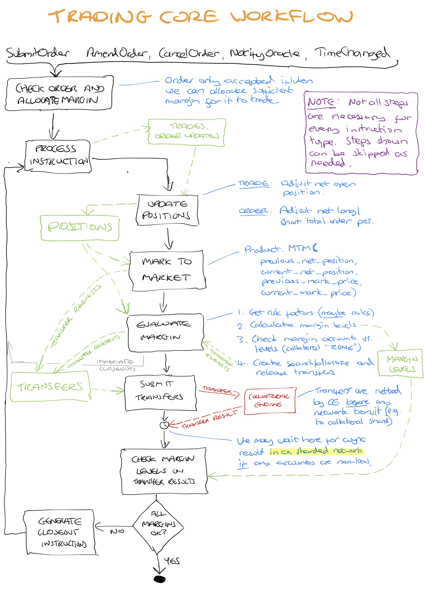

# Outline

This is an attempt to document the flow of processing orchestrated by the trading core when processing market instructions and dealing with the resulting new Trades and Order updates.

# Acceptance Criteria

The order of processing of transactions happens in the order defined in the diagram, specifically:

1. [ ] Before a valid order is processed in any other way by Vega, the party's margin levels are checked as though they had the order in their position, and any transfers that are needed to support that order occur.

1. [ ] Following all of the matching of trades resulting from a single order or the acceptance of an order onto the order book, there will be changes in positions for one or more traders.

1. [ ] Following all of the matching of trades resulting from a single order or the acceptance of an order onto the order book, there may be a change to the Mark Price.

1.  [ ] Following the above 3 actions,  a mark to market settlement is run for all parties against their most recently updated positions and Mark Price. This will result in a set of transfers between the parties' accounts and possibly may result in loss socialisation occurring if a party has insufficient collateral to cover the move.

1. [ ] Following the mark to market settlement, the margin liabilities for traders are evaluated against their collateral balances. Any traders that do not have sufficient collateral to support their positions (after collateral searches have been done to their main account) will undergo position resolution.

1. [ ] After position resolution has occurred, margins are recalculated and evaluated against balances for any traders that gained positions as a result of supplying liquidity on the order book to the network during position resolution.

1. [ ] This continues until no position resolution occurs. Then the next transaction is processed.

