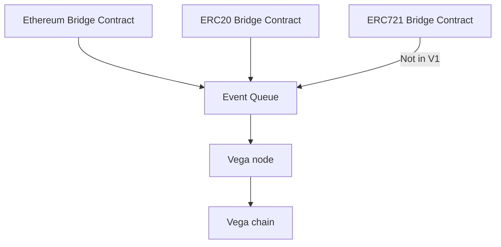
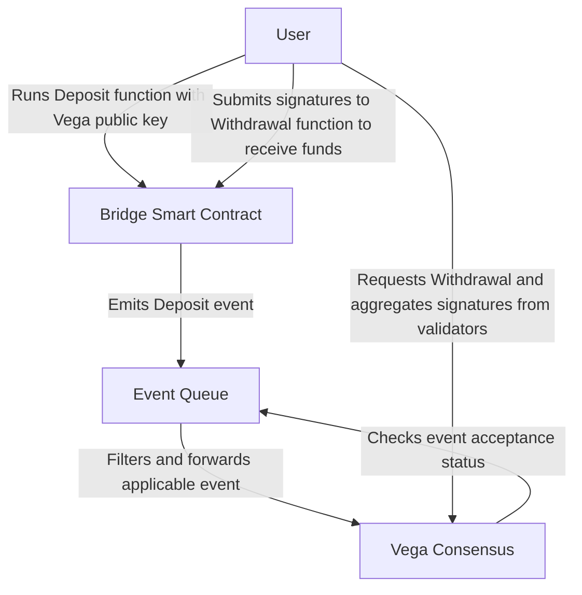

# Ethereum bridge

## Summary

In order to integrate Vega with various external blockchains to allow the deposit and withdrawal of settlement instruments (assets) into and out of the Vega network, we’ve determined that a set of “bridge” smart contracts along with an ‘event queue’ process to find and propagate applicable on-chain events is necessary for the deposit and withdrawal of funds/assets from Vega. This, collectively, is named the Vega Ramp as it is the on- and off-ramp of all assets regardless of chain of origin. This spec covers the bridges.

## Guide-level explanation

This document outlines how assets will be able to be deposited from and withdrawn to Ethereum addresses. This will be achieved with a few new moving parts, outlined below:



There will be one smart contract per Ethereum asset class (such as ETH or ERC-20 tokens). We will consider new token standards as they are used, and develop new smart contracts to handle those. Regardless of asset type, the new Event Bus will be polling an Ethereum node for events on the known smart contracts, and pushing those in to Vega through a new API.

### On Chain Event Recording

In order to enable decentralised and secure depositing and withdrawal of funds, we have created a series of “bridge” smart contracts. These bridges each target a specific asset class, such as ETH or ERC-20 tokens, and expose simple functionality to allow the Vega network to accept deposits, hold, and then release assets as needed. This immutably records all deposits and withdrawals for all of the assets that Vega markets use, as well as any governance pertaining to the bridge smart contracts.
Each bridge contains two primary functions and emits two primary events, each tailored to the asset class. They are deposit and withdraw and the corresponding events of deposited and withdrawn. Deposit is ran by a user or process and ensures that the asset is stored safely on-contract and then emits the deposited event. The withdrawal function itself is run by the user or process once signatures have been aggregated from validator nodes. This multisig aggregation is out of the scope of this specification and will be covered elsewhere.

### Block confirmations

It is normal behaviour when validating transfers to wait a certain number of blocks for a deposit to be 'confirmed'. We need to do the same, to have acceptably high probability that the event is on the longest chain and there won't be a fork in the future which will invalidate this. We achieve this by ensuring that enough time has passed.

This will need to be configured per chain that we connect to. ETH, ERC-20, ERC-XXX can all share a value, which should be configurable and changeable via governance. For Ethereum, this should be 20 confirmations. It is safe to lower this for development networks.

## Reference-level explanation



### Bridge smart contracts

For each asset class, there is a bridge smart contract. Currently all contracts are Ethereum-based assets, namely Ether and ERC-20 tokens. In the future ERC-721 nonfungible tokens, ERC1155 crypto items, and Oracle Controlled Assets (assets that are reported by an authority) and other asset classes will be added. Each asset class will receive a bridge contract on the appropriate platform (ETH, EOS, Tron, etc).

### Deposits

Deposits happen when a user runs the deposit function of a bridge contract for a given asset. Once this is executed on-chain, an event is raised from the Ethereum protocol. This event is processed by the event queue (covered in another spec) which passes the event to Vega Consensus. Each node receives notice of the event either from the Event Queue or through inter-node gossip and validates the transaction for itself on its local external blockchain node (such as Geth, Parity, etc). This necessitates each node to either run a given blockchain node locally or have a trusted source to the node.

### Withdrawals

Withdrawals happen when a user decides to withdrawal funds from Vega and/or Vega consensus decides release an asset to a user. When this happens, the client aggregates signatures from the validator nodes (covered elsewhere). Once a threshold of signatures is reached, the client runs the `withdraw_asset` command while providing the bundle of authorised signatures.

#### Pseudo-code / Examples

Each bridge implements a standard interface (Ethereum shown here):

```go
pragma solidity ^0.5.0;


contract IVega_Bridge {

    event Asset_Withdrawn(address indexed user_address, address indexed asset_source, uint256 indexed asset_id, uint256 amount);
    event Asset_Deposited(address indexed user_address, address indexed asset_source, uint256 indexed asset_id, uint256 amount, bytes32 vega_public_key);
    event Asset_Deposit_Minimum_Set(address indexed asset_source, uint256 indexed asset_id, uint256 new_minimum);
    event Asset_Whitelisted(address indexed asset_source, uint256 indexed asset_id);
    event Asset_Blacklisted(address indexed asset_source, uint256 indexed asset_id);
    event Multisig_Control_Set(address indexed multisig_control_source);

    function whitelist_asset(address asset_source, uint256 asset_id, uint256 nonce, bytes memory signatures) public;
    function blacklist_asset(address asset_source, uint256 asset_id, uint256 nonce, bytes memory signatures) public;
    function set_deposit_minimum(address asset_source, uint256 asset_id, uint256 nonce, uint256 minimum_amount, bytes memory signatures) public;
    function withdraw_asset(address asset_source, uint256 asset_id, uint256 amount, uint256 nonce, bytes memory signatures) public;
    function deposit_asset(address asset_source, uint256 asset_id, uint256 amount, bytes32 vega_public_key) public;
    function set_multisig_control(address new_multisig_contract_address) public;

    // VIEWS /////////////////
    function is_asset_whitelisted(address asset_source, uint256 asset_id) public view returns(bool);
    function get_deposit_minimum(address asset_source, uint256 asset_id) public view returns(uint256);
    function get_multisig_control_address() public view returns(address);
}

```

### Allow-listing and Block-listing

The ERC-20 contract, and any other contract that represents an asset class rather than an individual asset, will maintain a whitelist of assets that can and cannot be deposited. Only allow listed assets can be deposited.

- An asset that is on the allowed list can be withdrawn and deposited
- An asset that is not on the allowed list can be withdrawn but not deposited

#### Allow-listing

Allow listing an asset occurs through a governance decision on the Vega chain. Eventually a user will be in possession of a bundle of signatures that they will send to the smart contract, along with the contact address of the asset to be whitelisted. After this has been accepted on the Ethereum chain, events for that asset will start being sent through to nodes via the Event Bus.

The list of assets that are allow listed could be inferred by looking through the chain at asset-related governance decisions, but the duty of storing the allowed list is with the Ethereum bridge smart contract, which stores the list on the ethereum chain. This list is also available through watching for the `list_asset` event raised by the smart contract.

#### Block-listing

Block listing is simply removing an asset from the whitelist via the `remove_asset` function.

## Network Parameters

The Ethereum Bridge uses 1 network parameter, `blockchains.ethereumConfig`, a JSON value which must configure:

| Property         | Type   | Example value | Description |
|------------------|--------| ------------|--------------|
| `chain_id`       | String |  `"3"`        | Ethereum [Chain ID](https://eips.ethereum.org/EIPS/eip-155) to connect to |
| `network_id`     | String |  `"3"`        | Ethereum [Network ID](https://eips.ethereum.org/EIPS/eip-155) to connect to     |
| `collateral_bridge_contract` | {string, integer} | `{address: "0xCcB517899f714BD1B2f32931fF429aDEdDd02A93", deployment_height: 1}`            | The address for a deployed instance of the bridge contract |
| `staking_bridge_contract` | {string, integer} | `{address: "0xCcB517899f714BD1B2f32931fF429aDEdDd02A93", deployment_height: 1}`            | The addresses to listen to for [staking events](./0059-STKG-simple_staking_and_delegating.md). |
| `token_vesting_contract` | {string, integer} | `{address: "0xCcB517899f714BD1B2f32931fF429aDEdDd02A93", deployment_height: 1}`            | The addresses to listen to for [vesting contract events](./0059-STKG-simple_staking_and_delegating.md). |
| `multisig_control_contract` | {string, integer} | `{address: "0xCcB517899f714BD1B2f32931fF429aDEdDd02A93", deployment_height: 1}`            | The addresses to listen to for multisig control event |
| `confirmations`  | Integer |  `3`           | Block confirmations to wait for before confirming an action   |

### Full example

This example connects the network to Ropsten:

```json
{
  "network_id": "3",
  "chain_id": "3",
  "collateral_bridge_contract": {address: "0xCcB517899f714BD1B2f32931fF429aDEdDd02A93", deployment_height: 1},
  "staking_bridge_contract": {address: "0xCcB517899f714BD1B2f32931fF429aDEdDd02A93", deployment_height: 1},
  "token_vesting_contract": {address: "0xCcB517899f714BD1B2f32931fF429aDEdDd02A93", deployment_height: 1},
  "multisig_control_contract": {address: "0xCcB517899f714BD1B2f32931fF429aDEdDd02A93", deployment_height: 1},
  "confirmations": 3
}
```

## Acceptance Criteria

### Deposit

- ERC-20 smart contract (This can be repeated for many token standards - NFTs and crypto items will be more complex):
  - A wallet address can call the deposit function and successfully deposit any token that is listed via `list_asset` via any asset bridge (<a name="0031-ETHB-084" href="#0031-ETHB-084">0031-ETHB-084</a>).
  - A deposit call with a removed token `remove_asset` is rejected (<a name="0031-COSMICELEVATOR-009" href="#0031-COSMICELEVATOR-009">0031-COSMICELEVATOR-009</a>)

### Withdraw

- ERC-20 smart contract specific requirements:
  - A valid multisig bundle can be passed to the withdraw function to successfully withdraw an ERC-20 asset to a wallet address via any asset bridge (<a name="0031-ETHB-085" href="#0031-ETHB-085">0031-ETHB-085</a>)
  - An invalid multisig bundle will be rejected from withdraw (<a name="0031-ETHB-014" href="#0031-ETHB-014">0031-ETHB-014</a>)

### Allowlist a token (by eth address)

- ERC-20 smart contract specific requirements:
  - A valid multisig bundle can be passed to the `list_asset` function to successfully add a token to the allowed list (<a name="0031-ETHB-016" href="#0031-ETHB-016">0031-ETHB-016</a>)
  - An invalid multisig bundle is rejected by the `list_asset` function (<a name="0031-ETHB-017" href="#0031-ETHB-017">0031-ETHB-017</a>)

### ERC20 Bridge Logic to Vega Integration Tests (Vega System Tests)

To ensure complete coverage of public and external smart contract functions, listed below are all of the callable functions on `ERC20_Bridge_Logic` and their corresponding acceptance criteria.

1. `address payable public erc20_asset_pool_address;`
    - must match the deployed asset pool address (<a name="0031-ETHB-018" href="#0031-ETHB-018">0031-ETHB-018</a>)
1. `function list_asset(address asset_source,bytes32 vega_asset_id,uint256 lifetime_limit,uint256 withdraw_threshold,uint256 nonce,bytes memory signatures)`
    - must list asset (<a name="0031-ETHB-019" href="#0031-ETHB-019">0031-ETHB-019</a>)
    - must not list already-listed asset (<a name="0031-ETHB-020" href="#0031-ETHB-020">0031-ETHB-020</a>)
    - must not list if bad signatures (<a name="0031-ETHB-021" href="#0031-ETHB-021">0031-ETHB-021</a>)
    - must not list if already listed (<a name="0031-ETHB-022" href="#0031-ETHB-022">0031-ETHB-022</a>)
1. `function remove_asset(address asset_source,uint256 nonce,bytes memory signatures)`
    - must remove asset (<a name="0031-ETHB-023" href="#0031-ETHB-023">0031-ETHB-023</a>)
    - must fail if asset not listed (<a name="0031-ETHB-024" href="#0031-ETHB-024">0031-ETHB-024</a>)
    - must fail if bad signatures (<a name="0031-ETHB-025" href="#0031-ETHB-025">0031-ETHB-025</a>)
1. `uint256 public default_withdraw_delay = 432000;`
    - must show 432000 (<a name="0031-ETHB-026" href="#0031-ETHB-026">0031-ETHB-026</a>)
1. `bool public is_stopped;`
    - must be false at first (<a name="0031-ETHB-027" href="#0031-ETHB-027">0031-ETHB-027</a>)
    - must be true after `global_stop` called (<a name="0031-ETHB-028" href="#0031-ETHB-028">0031-ETHB-028</a>)
1. `function set_asset_limits(address asset_source,uint256 lifetime_limit,uint256 threshold,uint256 nonce,bytes calldata signatures)`
    - changes asset limits (<a name="0031-ETHB-029" href="#0031-ETHB-029">0031-ETHB-029</a>)
    - must fail if bad signatures (<a name="0031-ETHB-030" href="#0031-ETHB-030">0031-ETHB-030</a>)
    - asset must be listed (<a name="0031-ETHB-031" href="#0031-ETHB-031">0031-ETHB-031</a>)
1. `function get_asset_deposit_lifetime_limit(address asset_source)`
    - must return asset lifetime limit (<a name="0031-ETHB-032" href="#0031-ETHB-032">0031-ETHB-032</a>)
1. `function get_withdraw_threshold(address asset_source)`
    - must return withdraw threshold (<a name="0031-ETHB-033" href="#0031-ETHB-033">0031-ETHB-033</a>)
1. `function set_withdraw_delay(uint256 delay,uint256 nonce,bytes calldata signatures)`
    - must set withdraw delay (<a name="0031-ETHB-034" href="#0031-ETHB-034">0031-ETHB-034</a>)
    - must fail if bad signatures (<a name="0031-ETHB-036" href="#0031-ETHB-036">0031-ETHB-036</a>)
1. `function global_stop(uint256 nonce, bytes calldata signatures)`
    - must set `is_stopped` to `true` (<a name="0031-ETHB-037" href="#0031-ETHB-037">0031-ETHB-037</a>)
    - must stop deposits (<a name="0031-ETHB-038" href="#0031-ETHB-038">0031-ETHB-038</a>)
    - must stop withdrawals (<a name="0031-ETHB-039" href="#0031-ETHB-039">0031-ETHB-039</a>)
    - must not be stopped already (<a name="0031-ETHB-040" href="#0031-ETHB-040">0031-ETHB-040</a>)
    - must fail on bad signatures (<a name="0031-ETHB-041" href="#0031-ETHB-041">0031-ETHB-041</a>)
1. `function global_resume(uint256 nonce, bytes calldata signatures)`
    - must set `is_stopped` to `false` (<a name="0031-ETHB-042" href="#0031-ETHB-042">0031-ETHB-042</a>)
    - must resume deposits (<a name="0031-ETHB-043" href="#0031-ETHB-043">0031-ETHB-043</a>)
    - must resume withdrawals (<a name="0031-ETHB-044" href="#0031-ETHB-044">0031-ETHB-044</a>)
    - must already be stopped (<a name="0031-ETHB-045" href="#0031-ETHB-045">0031-ETHB-045</a>)
    - must fail on bad signatures (<a name="0031-ETHB-046" href="#0031-ETHB-046">0031-ETHB-046</a>)
1. `function exempt_depositor()`
    - must exempt caller from lifetime deposits (<a name="0031-ETHB-047" href="#0031-ETHB-047">0031-ETHB-047</a>)
    - must not be already exempt (<a name="0031-ETHB-048" href="#0031-ETHB-048">0031-ETHB-048</a>)
1. `function revoke_exempt_depositor()`
    - must revoke lifetime deposit exemption (<a name="0031-ETHB-049" href="#0031-ETHB-049">0031-ETHB-049</a>)
    - must already be exempt (<a name="0031-ETHB-050" href="#0031-ETHB-050">0031-ETHB-050</a>)
1. `function is_exempt_depositor(address depositor) external view override returns (bool)`
    - must show lifetime deposit exemption (<a name="0031-ETHB-051" href="#0031-ETHB-051">0031-ETHB-051</a>)
1. `function withdraw_asset(address asset_source,uint256 amount,address target,uint256 creation,uint256 nonce,bytes memory signatures)`
    - must withdraw asset specified (<a name="0031-ETHB-052" href="#0031-ETHB-052">0031-ETHB-052</a>)
    - must fail on bad signatures (<a name="0031-ETHB-053" href="#0031-ETHB-053">0031-ETHB-053</a>)
    - must fail on non-matching parameters (<a name="0031-ETHB-054" href="#0031-ETHB-054">0031-ETHB-054</a>)
    - must fail on expired withdrawal order (<a name="0031-ETHB-082" href="#0031-ETHB-082">0031-ETHB-082</a>)
    - must fail on delay not yet elapsed (<a name="0031-ETHB-083" href="#0031-ETHB-083">0031-ETHB-083</a>)
1. `function deposit_asset(address asset_source,uint256 amount,bytes32 vega_public_key)`
    - must deposit asset from user (<a name="0031-ETHB-055" href="#0031-ETHB-055">0031-ETHB-055</a>)
    - must be listed (<a name="0031-ETHB-056" href="#0031-ETHB-056">0031-ETHB-056</a>)
    - must be exempt or below lifetime deposit limit (<a name="0031-ETHB-057" href="#0031-ETHB-057">0031-ETHB-057</a>)
    - must fail if over lifetime limit and not exempt (<a name="0031-ETHB-058" href="#0031-ETHB-058">0031-ETHB-058</a>)
    - must be credited on Vega (<a name="0031-ETHB-059" href="#0031-ETHB-059">0031-ETHB-059</a>)
1. `function is_asset_listed(address asset_source) external view override returns (bool)`
    - must be true if asset is listed (<a name="0031-ETHB-060" href="#0031-ETHB-060">0031-ETHB-060</a>)
    - must be false if asset is not listed (<a name="0031-ETHB-061" href="#0031-ETHB-061">0031-ETHB-061</a>)
    - when true, deposits must work (<a name="0031-ETHB-062" href="#0031-ETHB-062">0031-ETHB-062</a>)
    - when false deposits must not work (<a name="0031-ETHB-063" href="#0031-ETHB-063">0031-ETHB-063</a>)
1. `function get_multisig_control_address() external view override returns (address)`
    - must show deployed multisig address (<a name="0031-ETHB-064" href="#0031-ETHB-064">0031-ETHB-064</a>)
1. `function get_vega_asset_id(address asset_source) external view override returns (bytes32)`
    - must return proper Vega asset ID (<a name="0031-ETHB-065" href="#0031-ETHB-065">0031-ETHB-065</a>)
1. `function get_asset_source(bytes32 vega_asset_id) external view override returns (address)`
    - must return the deployed asset address from Vega asset ID (<a name="0031-ETHB-066" href="#0031-ETHB-066">0031-ETHB-066</a>)

### ERC-20 Asset Pool to Vega Integration Tests (Vega System Tests)

To ensure complete coverage of public and external smart contract functions, listed below are all of the callable functions on ERC20_Asset_Pool and their corresponding acceptance criteria.

1. `address public multisig_control_address;`
    - must show the current multisig control address (<a name="0031-ETHB-067" href="#0031-ETHB-067">0031-ETHB-067</a>)
    - must change to reflect a successful set_multisig_control call (<a name="0031-ETHB-068" href="#0031-ETHB-068">0031-ETHB-068</a>)
1. `address public erc20_bridge_address;`
    - must show current deployed `erc20_bridge` address (<a name="0031-ETHB-069" href="#0031-ETHB-069">0031-ETHB-069</a>)
    - must change to reflect a successful set_bridge_address call (<a name="0031-ETHB-070" href="#0031-ETHB-070">0031-ETHB-070</a>)
1. `receive() external payable // fallback, should fail`
1. `function set_multisig_control(address new_address,uint256 nonce,bytes memory signatures)`
    - must set multisig control (<a name="0031-ETHB-071" href="#0031-ETHB-071">0031-ETHB-071</a>)
    - must be reflected in `multisig_control_address` (<a name="0031-ETHB-072" href="#0031-ETHB-072">0031-ETHB-072</a>)
    - must fail on bad signatures (<a name="0031-ETHB-073" href="#0031-ETHB-073">0031-ETHB-073</a>)
1. `function set_bridge_address(address new_address,uint256 nonce,bytes memory signatures)`
    - must set bridge address (<a name="0031-ETHB-074" href="#0031-ETHB-074">0031-ETHB-074</a>)
    - must be reflected in `erc20_bridge_address` (<a name="0031-ETHB-075" href="#0031-ETHB-075">0031-ETHB-075</a>)
    - must fail on bad signatures (<a name="0031-ETHB-076" href="#0031-ETHB-076">0031-ETHB-076</a>)
1. `function withdraw(address token_address,address target,uint256 amount)`
    - must remit the `amount` of `token_address` to the `target` address (<a name="0031-ETHB-077" href="#0031-ETHB-077">0031-ETHB-077</a>)
    - must be runnable from the current `erc20_bridge_address` address (<a name="0031-ETHB-078" href="#0031-ETHB-078">0031-ETHB-078</a>)
    - must fail if ran by any other address (<a name="0031-ETHB-079" href="#0031-ETHB-079">0031-ETHB-079</a>)
    - must work for new bridge after bridge address changed (<a name="0031-ETHB-080" href="#0031-ETHB-080">0031-ETHB-080</a>)
    - must fail for old bridge after bridge address changed (<a name="0031-ETHB-081" href="#0031-ETHB-081">0031-ETHB-081</a>)
