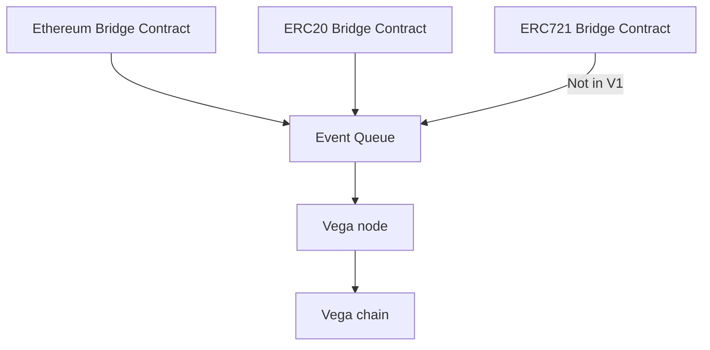
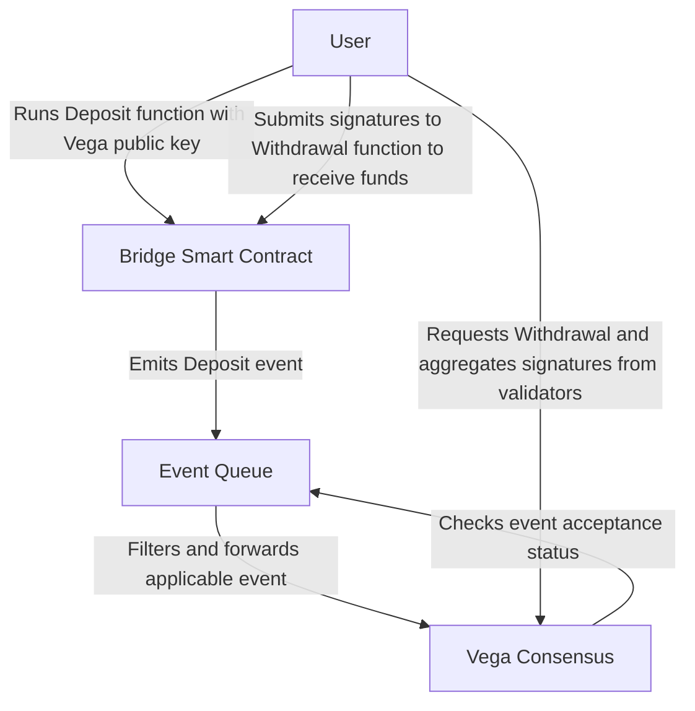

* Feature name: ethereum-bridge
* Start date: 2020-03-10


# Summary
In order to integrate Vega with various external blockchains to allow the deposit and withdrawal of settlement instruments (assets) into and out of the Vega network, we’ve determined that a set of “bridge” smart contracts along with an ‘event queue’ process to find and propagate applicable on-chain events is necessary for the deposit and withdrawal of funds/assets from Vega. This, collectively, is named the Vega Ramp as it is the on- and off-ramp of all assets regardless of chain of origin. This spec covers the bridges.


# Guide-level explanation
This document outlines how assets will be able to be deposited from and withdrawn to Ethereum addresses. This will be achieved with a few new moving parts, outlined below:



There will be one smart contract per Ethereum asset class (such as ETH or ERC20 tokens). We will consider new token standards as they are used, and develop new smart contracts to handle those. Regardless of asset type, the new Event Bus will be polling an Ethereum node for events on the known smart contracts, and pushing those in to Vega through a new API.

## On Chain Event Recording
In order to enable decentralized and secure depositing and withdrawal of funds, we have created a series of “bridge” smart contracts. These bridges each target a specific asset class, such as ETH or ERC20 tokens, and expose simple functionality to allow the Vega network to accept deposits, hold, and then release assets as needed. This immutably records all deposits and withdrawals for all of the assets that Vega markets use, as well as any governance pertaining to the bridge smart contracts.
Each bridge contains two primary functions and emits two primary events, each tailored to the asset class. They are deposit and withdraw and the corresponding events of deposited and withdrawn. Deposit is ran by a user or process and ensures that the asset is stored safely on-contract and then emits the deposited event. The withdrawal function itself is run by the user or process once signatures have been aggregated from validator nodes. This multisig aggregation is out of the scope of this specification and will be covered elsewhere.

## Block confirmations
It is normal behaviour when validating transfers to wait a certain number of blocks for a deposit to be 'confirmed'. For example, [this is Kraken's wait time](https://support.kraken.com/hc/en-us/articles/203325283-Cryptocurrency-deposit-processing-times). We need to do the same, to be sure that enough time has passed that it is a certainty that the event we saw is included in the chain.

This will need to be configured per chain that we connect to. ETH, ERC20, ERCXXX can all share a value, which should be configurable and changeable via governance. For Ethereum, this should be 20 confirmations. It is safe to lower this for development networks.

# Reference-level explanation



### Bridge smart contracts
For each asset class, there is a bridge smart contract. Currently all contracts are Ethereum-based assets, namely Ether and ERC20 tokens. In the future ERC721 nonfungible tokens, ERC1155 crypto items, and Oracle Controlled Assets (assets that are reported by an authority) and other asset classes will be added. Each asset class will receive a bridge contract on the appropriate platform (ETH, EOS, Tron, etc).

### Deposits
Deposits happen when a user runs the deposit function of a bridge contract for a given asset. Once this is executed on-chain, an event is raised from the Ethereum protocol. This event is processed by the event queue (covered in another spec) which passes the event to Vega Consensus. Each node recieves notice of the event either from the Event Queue or through inter-node gossip and validates the transaction for itself on its local external blockchain node (such as Geth, Parity, etc). This necessitates each node to either run a given blockchain node locally or have a trusted source to the node.

### Withdrawals 
Withdrawals happen when a user decides to withdrawal funds from Vega and/or Vega consensus decides release an asset to a user. When this happens, the client aggregates signatures from the validator nodes (covered elsewhere). Once a threshold of signatures is reached, the client runs the `withdraw_asset` command while providing the bundle of authorized signatures.


#### Pseudo-code / Examples
Each bridge implements a standard interface (Ethereum shown here):
```go
pragma solidity ^0.5.0;


contract IVega_Bridge {

    event Asset_Withdrawn(address indexed user_address, address indexed asset_source, uint256 indexed asset_id, uint256 amount);
    event Asset_Deposited(address indexed user_address, address indexed asset_source, uint256 indexed asset_id, uint256 amount, bytes32 vega_public_key);
    event Asset_Deposit_Minimum_Set(address indexed asset_source, uint256 indexed asset_id, uint256 new_minimum);
    event Asset_Whitelisted(address indexed asset_source, uint256 indexed asset_id);
    event Asset_Blacklisted(address indexed asset_source, uint256 indexed asset_id);
    event Multisig_Control_Set(address indexed multisig_control_source);

    function whitelist_asset(address asset_source, uint256 asset_id, uint256 nonce, bytes memory signatures) public;
    function blacklist_asset(address asset_source, uint256 asset_id, uint256 nonce, bytes memory signatures) public;
    function set_deposit_minimum(address asset_source, uint256 asset_id, uint256 nonce, uint256 minimum_amount, bytes memory signatures) public;
    function withdraw_asset(address asset_source, uint256 asset_id, uint256 amount, uint256 nonce, bytes memory signatures) public;
    function deposit_asset(address asset_source, uint256 asset_id, uint256 amount, bytes32 vega_public_key) public;
    function set_multisig_control(address new_multisig_contract_address) public;

    // VIEWS /////////////////
    function is_asset_whitelisted(address asset_source, uint256 asset_id) public view returns(bool);
    function get_deposit_minimum(address asset_source, uint256 asset_id) public view returns(uint256);
    function get_multisig_control_address() public view returns(address);
}

```

### Whitelisting and Blacklisting 
The ERC20 contract, and any other contract that represents an asset class rather than an individual asset, will maintain a whitelist of assets that can and cannot be deposited. Only whitelisted assets can be deposited.
* An asset that is on the whitelist can be withdrawn and deposited
* An asset that is not on the whitelist can be withdrawn but not deposited

#### Whitelisting
Whitelisting an asset occurs through a governance decision on the Vega chain. Eventually a user will be in possession of a bundle of signatures that they will send to the smart contract, along with the contact address of the asset to be whitelisted. After this has been accepted on the Ethereum chain, events for that asset will start being sent through to nodes via the Event Bus.

The list of assets that are whitelisted could be inferred by looking through the chain at asset-related governance decisions, but the duty of storing the whitelist is with the Ethereum bridge smart contract, which stores the list on the ethereum chain. This list is also available through watching for the `asset whitelisted` event raised by the smart contract.

#### Blacklisting
Blacklisting is simply removing an asset from the whitelist


# Network Parameters
The Ethereum Bridge uses 1 network parameter, `blockchains.ethereumConfig`, a JSON value which must configure:

| Property         | Type   | Example value | Description |
|------------------|--------| ------------|--------------|
| `chain_id`       | String |  `"3"`        | Ethereum [Chain ID](https://eips.ethereum.org/EIPS/eip-155) to connect to 
| `network_id`     | String |  `"3"`        | Ethereum [Network ID](https://eips.ethereum.org/EIPS/eip-155) to connect to     |
| `collateral_bridge_address` | String | `"0xCcB517899f714BD1B2f32931fF429aDEdDd02A93"`            | The address for a deployed instance of the bridge contract |
| `staking_bridge_address` | Array(strings) | `["0xCcB517899f714BD1B2f32931fF429aDEdDd02A93"]`            | The addresses to listen to for [staking events](./0059-STKG-simple_staking_and_delegating.md). |
| `confirmations`  | Integer |  `3`           | Block confirmations to wait for before confirming an action   |

### Full example
This example connects the network to Ropsten:

```json
{
  "network_id": "3",
  "chain_id": "3",
  "bridge_address": "0xCcB517899f714BD1B2f32931fF429aDEdDd02A93", 
  "confirmations": 3
}
```

# Acceptance Criteria

## Deposit
* ETH smart contract specific requirements:
  * A multisig bundle can be passed to the setMinimum function to successfully update the minimum deposit size (<a name="0031-ETHB-002" href="#0031-ETHB-002">0031-ETHB-002</a>)
  * An Ethereum Address can call the deposit function and successfully deposit Ethereum, as long as it is above the minimum size deposit (<a name="0031-ETHB-003" href="#0031-ETHB-003">0031-ETHB-003</a>)
  * A request to deposit any non-Ethereum asset is rejected (<a name="0031-ETHB-004" href="#0031-ETHB-004">0031-ETHB-004</a>)
  * A deposit call that is below the minimum size is rejected (<a name="0031-ETHB-005" href="#0031-ETHB-005">0031-ETHB-005</a>)

* ERC20 smart contract (This can be repeated for many token standards - NFTs and crypto items will be more complex):
  * A valid multisig bundle can be passed to the setMinimum function to successfully update the minimum deposit size for a whitelisted token (<a name="0031-ETHB-006" href="#0031-ETHB-006">0031-ETHB-006</a>)
  * A valid multisig bundle can not be passed to the setMinimum function for a token that is not whitelisted (<a name="0031-ETHB-007" href="#0031-ETHB-007">0031-ETHB-007</a>)
  * An Ethereum Address can call the deposit function and successfully deposit any whitelisted token, as long as it is above the minimum size deposit (<a name="0031-ETHB-008" href="#0031-ETHB-008">0031-ETHB-008</a>)
  * A deposit call with a blacklisted token is rejected (<a name="0031-ETHB-009" href="#0031-ETHB-009">0031-ETHB-009</a>)
  * A deposit call with a whitelisted token that is below the minimum size is rejected(<a name="0031-ETHB-010" href="#0031-ETHB-010">0031-ETHB-010</a>)

## Withdraw
* ETH smart contract specific requirements:
  * A valid multisig bundle can be passed to the withdraw function to successfully withdraw ETH (<a name="0031-ETHB-011" href="#0031-ETHB-011">0031-ETHB-011</a>)
  * An  invalid multisig bundle will be rejected from withdraw (<a name="0031-ETHB-012" href="#0031-ETHB-012">0031-ETHB-012</a>)
* ERC20 smart contract specific requirements:
  * A valid multisig bundle can be passed to the withdraw function to successfully withdraw ETH (<a name="0031-ETHB-013" href="#0031-ETHB-013">0031-ETHB-013</a>)
  * An invalid multisig bundle will be rejected from withdraw (<a name="0031-ETHB-014" href="#0031-ETHB-014">0031-ETHB-014</a>)

## Allowlist a token (by eth address)
* ERC20 smart contract specific requirements:
  * A valid multisig bundle can be passed to the whitelistToken function to successfully add a token to the whitelist (<a name="0031-ETHB-016" href="#0031-ETHB-016">0031-ETHB-016</a>)
  * An invalid multisig bundle is rejected by the whitelistToken function (<a name="0031-ETHB-017" href="#0031-ETHB-017">0031-ETHB-017</a>)

## Blocklist a token (by eth address)
* ERC20 smart contract specific requirements:
  * A valid multisig bundle can be passed to the blacklistToken function to successfully remove a previously whitelisted token (<a name="0031-ETHB-019" href="#0031-ETHB-019">0031-ETHB-019</a>)
  * An invalid multisig bundle is rejected by the blacklistToken function (<a name="0031-ETHB-020" href="#0031-ETHB-020">0031-ETHB-020</a>)

## Set deposit minimum
*  A valid multisig bundle can be passed to the setDepositMinimum function to successfully set a deposit minimum for a given asset (<a name="0031-ETHB-023" href="#0031-ETHB-023">0031-ETHB-023</a>)
*  an invalid multisig bundle is rejected by the setDepositMinimum function (<a name="0031-ETHB-024" href="#0031-ETHB-024">0031-ETHB-024</a>)

