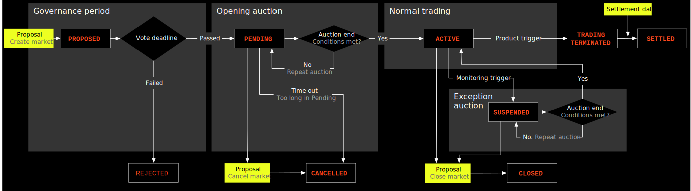

# Market Lifecycle

This spec describes the lifecycle of a market. The market lifecycle begins at acceptance of a proposal and is driven by the market's `status`. Each status and the entry and exit criteria are described below.

## Market proposal and creation

Markets on Vega are proposed, permissionless, using the [governance mechanism](./0028-GOVE-governance.md#1-create-market). If a market passes the governance vote, it undergoes various state changes throughout its lifecycle. Aspects of the state that change include:

- trading mode
- whether the market is open for trading
- status of settlement

Markets proposed via [governance proposals](./0028-GOVE-governance.md#1-create-market) undergo certain additional validations. Note the distinctions between a proposal that is `valid` or `accepted` and a proposal that is `sucessful`. A `valid` proposal has passed or will pass validation checks; an `accepted` proposal has been received in a Vega transaction and passed validation checks; and a `successful` proposal has been voted for and won. The proposal becomes `enacted` when the action specified (i.e. for the purposes of this spec, market creation/update/close).

All markets are proposed without any [liquidity commitment](./0038-OLIQ-liquidity_provision_order_type.md).
If the proposal is successful the market will go into opening auction at least until the proposed `enactment` date.
However, the market may stay in an opening auction past the proposed `enactment` date until at least on party makes a liquidity commitment that meets criteria for exiting [liquidity auction](./0035-LIQM-liquidity_monitoring.md).

## Market lifecycle statuses

A market can progress through a number of statuses through its life. The overall market status flow is shown in the diagram below. A market is created in a `proposed` state when a valid market creation governance proposal is `accepted`.

| Status              | Accepting LPs[1]  | Trading Mode        | Condition for entry                                                           | Condition for exit
| ------------------ | -------------- | ------------------- | --------------------------------------------------------------- | -----------------------------------------
| Proposed           |   Yes          | No trading          | Governance proposal valid and accepted                                       | Governance proposal voting period ends
| Rejected           |   No           | No trading          | Outcome of governance votes is to reject the market             | N/A
| Pending            |   Yes          | Opening auction     | Governance vote passes/wins                                     | Governance vote (to close) OR enactment date reached
| Cancelled           |  No           | No trading          | Market triggers cancellation condition                          | N/A
| Active             |   Yes          | Normal trading      | Enactment date reached and usual auction exit checks pass       | Governance vote (to close) OR maturity of market
| Suspended          |   Yes          | Exceptional auction | Price monitoring or liquidity monitoring trigger, or product lifecycle trigger                | Exit conditions met per monitoring spec. that triggered it, no other monitoring triggered or governance vote if allowed (see below)
| Closed             |   No           | No trading          | Governance vote (to close)                                      | N/A
| Trading Terminated |   No           | No trading          | Defined by the product (i.e. from a product parameter, specified in market definition, giving close date/time) | Settlement event commences
| Settled            |   No           | No trading          | Settlement triggered and completed as defined by product                                      | N/A

[1] Accepting LPs: it is possible to make or amend [Liquidity Provision Commitments](./0038-OLIQ-liquidity_provision_order_type.md)

Note that there is no governance proposal to cancel a market. However it is possible to submit a market change proposal which will change the trading terminated trigger and the settlement price source. Thus, via governance, it is possible to get market into a cancelled state if it never left Pending state (opening auction) or settle a market immediately (if any positions were ever created on the market). Either of these effectively removes the market.

## Market status descriptions

### Proposed

All Markets are first [proposed via the governance mechanism](./0028-GOVE-governance.md#1-create-market). Once the valid Market Proposal is accepted *the Market (see [market framework](./0001-MKTF-market_framework.md)) is created* and can accept [Liquidity Provision Commitments](./0038-OLIQ-liquidity_provision_order_type.md), voting begins and its state is `proposed`.

**Entry:**

- Valid [governance proposal](./0028-GOVE-governance.md#1-create-market) submitted and accepted.

**Exit:**

- Market Proposal voting period ends

  - Passed (yes votes win & thresholds met) → Pending
  - Failed (no votes win or thresholds not met) → Rejected

**Behaviour:**

- Participants can vote for or against the Market Proposal
- Liquidity Providers can make, change, or exit Liquidity Commitments
- No trading is possible, no orders can be placed (except the buy/sell order shapes that form part of a Liquidity Commitment)
- No market data (price, etc.) is emitted, no positions exist on the market, and no risk management occurs

### Rejected

When a Market Proposal is not successful, see [governance proposal](./0028-GOVE-governance.md#outcome), Market state is Rejected.

**Entry:**

- Voting period ends
  - Failed (no votes win or thresholds not met) → Rejected

**Exit:**

- No exit. End state.

**Behaviour:**

- Nothing can happen to the market with this status - it does not exist (Vega core has no need to keep any information about this market proposal). Any collateral locked to liquidity commitments is returned to the general account of the party that submitted the liquidity commitment.

### Pending

When a Market Proposal is successful at the end of the voting period, the Market state becomes "Pending". Currently a Pending Market is always in an [auction call period](./0026-AUCT-auctions.md) that ends at the enactment date as specified in the Market Proposal if the other conditions for exiting auction period are met (liquidity committed, best static bid / ask present). If, initially, at the specified enactment date it was not possible to leave the auction period, the auction will conclude as soon as possible once the conditions for auction exit are met.

Note: this state represents any market that will be created, which currently means a Market Proposal vote has concluded successfully.

**Entry:**

- Valid [Market Proposal](./0028-GOVE-governance.md#1-create-market) was successful (yes votes win & thresholds met)

**Exit:**

Auction period ends when any of the following occur:

- Enactment date is reached and the [conditions for exiting an auction](./0026-AUCT-auctions.md) are met and at least one trade will be generated when uncrossing the auction → Active (the auction is uncrossed during this transition)
- Enactment date is passed and the product would trigger the Trading Terminated status  →  Cancelled (the market ceases to exist, auction orders are cancelled, and no uncrossing occurs)
- Enactment date is passed by more than the *maximum opening auction extension duration* Network Parameter →  Cancelled (the market ceases to exist, auction orders are cancelled, and no uncrossing occurs)
- Market change governance vote approves closure of market → Cancelled (the market ceases to exist, auction orders are cancelled, and no uncrossing occurs)

**Behaviour:**

- Liquidity providers can make, change, or exit commitments
- Auction orders are accepted as per [any regular auction period](./0026-AUCT-auctions.md).
- Margins on orders as per auction margin instructions in [margin calculator spec](./0019-MCAL-margin_calculator.md).

### Cancelled

A market becomes Cancelled when a Market Proposal is successful and conditions are not met to transition the Market to the Active state during the Pending period,
and the trading terminated data source input rings, see [data sourcing](./0045-DSRC-data_sourcing.md).
When a market transitions to a cancelled state all orders should be cancelled and collateral returned to respective parties general account for the relevant asset, all LP commitments should be cancelled and their bond returned to the general account for the relevant asset. After `market.liquidity.successorLaunchWindowLength` has elapsed since cancellation any insurance pool balance should be transferred into the network treasury account for that asset.

Once "cancelled" there must be no open positions tracked by the protocol for the market and any open positions must have been closed including returning all margin and other related collateral if necessary and also notifying downstream event consumers that the positions are closed. Specific position related actions may be unnecessary if the cancelled state is being entered from a state in which there cannot possibly have been any open positions.
All data sources that are only referenced by this market should be unregistered.

**Entry:**

- Enactment date is passed and the product would trigger the Trading Terminated status  →  Cancelled (the market ceases to exist, auction orders are cancelled, and no uncrossing occurs)
- Enactment date is passed by more than the *maximum opening auction extension duration* Network Parameter →  Cancelled (the market ceases to exist, auction orders are cancelled, and no uncrossing occurs)
- Market change governance vote approves closure of market → Cancelled (the market ceases to exist, auction orders are cancelled, and no uncrossing occurs)

**Exit:**

- No exit. End state.

**Behaviour:**

- Nothing can happen to the market with this status - it does not exist (Vega core has no need to keep any information about this market proposal).

### Active

Once the enactment date is reached and the other conditions specified to exit the Pending state are met, the market becomes Active on conclusion of uncrossing of the opening auction. This status indicates it is trading via its normally configured trading mode according to the market framework (continuous trading, frequent batch auction, RFQ, block only, etc.). The specification for the trading mode should describe which orders are accepted and how trading proceeds. The market will terminate trading according to a product trigger (for futures, if the trading termination date is reached) and can be temporarily suspended automatically by various monitoring systems ([price monitoring](./0032-PRIM-price_monitoring.md), [liquidity monitoring](./0035-LIQM-liquidity_monitoring.md)). The market can also be closed via a governance vote (market parameter update) to change the status to closed [see the governance spec](./0028-GOVE-governance.md).

**Entry:**

- From Pending: enactment date reached and conditions to transition from Pending state to Active as detailed above are met
- From Suspended: conditions specified in [price monitoring](./0032-PRIM-price_monitoring.md) and [liquidity monitoring](./0035-LIQM-liquidity_monitoring.md) are met for the market to exit the suspended status back to Active.

**Exit:**

- Price, liquidity or other monitoring system triggers suspension → Suspended
- Trading termination, settlement, or suspension is triggered by a product trigger (for futures, if the trading termination date, set by a market parameter, is reached) → Trading Terminated | Settled | Suspended
- Market change governance vote approves closure of market → Closed

**Behaviour:**

- Liquidity Providers can make, change, or exit Liquidity Commitments, as per conditions specified in the [liquidity mechanics spec](./0044-LIME-lp_mechanics.md).
- Orders can be placed into the market, trading occurs according to normal trading mode rules
- Market data is emitted
- Positions and margins are managed as per the specs

### Suspended

A Suspended market occurs when an Active market is temporarily stopped from trading to protect the market or the network from various types of risk. Suspension is used when the system has determined it is either not safe or not reasonable to operate the market at the current time, for example due to extremely low liquidity. No trades may be created while a market is Suspended.

Suspension currently always operates as an auction call period. Depending on the type of suspension, the auction call period may have a defined end (which can also be subject to extension) or may be indefinite in which case the auction will end once the required conditions are met. The auction is uncrossed as part of the transition back to the Active state and normal trading. Alternatively, a Suspended market may become closed in which case the auction does not uncross and the orders are discarded.

**Entry:**

- Price, liquidity or other monitoring system triggers suspension → Suspended

**Exit:**

- Conditions specified in [price monitoring](./0032-PRIM-price_monitoring.md) and [liquidity monitoring](./0035-LIQM-liquidity_monitoring.md) and the usual [ending of auction checks](./0026-AUCT-auctions.md) pass → Active
- Governance vote to close a market passes → Closed
- Market was suspended by governance vote of product lifecycle trigger and a governance vote passes to set the status to ACTIVE → Active

**Behaviour:**

- Liquidity providers can make, change, or exit commitments.
- Auction orders are accepted as per [any regular auction period](./0026-AUCT-auctions.md).
- Margins on orders as per auction based instructions in [margin calculator spec](./0019-MCAL-margin_calculator.md).

### Closed

Market goes into a closed state if a [governance vote to close it](./0028-GOVE-governance.md#6-close-market) passes and its enactment date is reached.

**Entry:**

- Governance vote to close a market passes → Closed

**Exit:**

No exit. This is a terminal state.

**Behaviour:**

- If market is in auction that auction gets uncrossed and any orders matched within it result in trades. All other orders get cancelled, no new orders are accepted, liquidity commitments cannot be modified, final settlement is carried out using the price supplied by the governance vote.

### Trading Terminated

A market may terminate trading if the product is one that expires or if the market is otherwise configured to have a finite lifetime.
In the case of futures, termination occurs at some point prior to the settlement of the product and is triggered by the trading terminated data source configured on the market. Markets in this state accept no trading, but retain the positions and margin balances that were in place after processing the trading terminated trigger (which may itself generate MTM cashflows, though for futures it doesn't).

A market moves from this termination state to Settled when enough information exists and the triggers are reached to settle the market. This could happen instantly upon trading termination if the data source message also contains the required settlement data, though usually there will be a delay, for instance, to wait for receipt and acceptance of data from a data source (oracle). An example of an instant transition would be where the trigger for terminating trading and the settlement are the publishing of a specific price from another market on the Vega network itself (same shard), or in the rare case of extremely delayed blocks meaning that the settlement data is available before the trigger is activated (note that market creators would be expected to allow enough of a buffer that this should effectively never happen).

**Entry:**

- Triggered by the product (in the case of futures, there is a product parameter that specifies when this will be triggered).

**Exit:**

- Settlement dependencies met (i.e. oracle data received) → Settled

**Behaviour:**

- No trading occurs, no orders are accepted
- Mark to market settlement is performed, if required, after termination is triggered, then never again
- A single set of market data may be emitted for the final settlement data (e.g. settlement mark price), after which no market data are emitted.
- During the transition out of this state:
  - All final settlement cashflows are calculated and applied (settled)
  - Margins are transferred back to general accounts
- No risk management or price/liquidity monitoring occurs

### Settled

Once the required data to calculate the settlement cashflows is provided by oracle input for a market in status Trading Terminated, these cashflows are calculated and applied to all traders with an open position (settlement).
The positions are then closed and all orders cleared.
All money held in margin accounts after final settlement is returned to traders' general accounts.
[LP fees](0042-LIQF-setting_fees_and_rewarding_lps.md) that have been cumulated but not yet paid out are distributed to the market LPs as per the LP spec.
After `market.liquidity.successorLaunchWindowLength` has elapsed since the settlement time

- [Insurance pool funds](./0015-INSR-market_insurance_pool_collateral.md) are transferred to the on-chain treasury for the asset for markets that have no successor market, see [governance](./0028-GOVE-governance.md). For markets that have a named successor market the insurance pool balance is transferred to the insurance pool of the successor market.
- The market can be deleted entirely at this point, from a core perspective.

**Entry:**

- Trading is Terminated
- Triggered by product logic and inputs (i.e. required data source/oracle data is received)

**Exit:**

- No exit. End state.

**Behaviour:**

- No trading occurs, no orders are accepted
- During the transition into this state:
  - All final settlement cashflows are calculated and applied (settled)
  - Margins are transferred back to general accounts
  - All fees are distributed (after a delay/at the next relevant epoch if needed - this means the market may continue to need to be "tracked" by the core until this step is complete)
- Market is over and can be removed from core data, nothing happens after the final settlement above is complete.

## Acceptance Criteria

### Market is proposed but rejected (<a name="0043-MKTL-001" href="#0043-MKTL-001">0043-MKTL-001</a>)(<a name="0043-SP-MKTL-001" href="#0043-SP-MKTL-001">0043-SP-MKTL-001</a>)

1. Market `m1` is proposed with an internal trading terminated oracle set for some time in the future. Price monitoring is configured (e.g. like `2668-price-monitoring.feature`).
Market state is `proposed`.
1. Parties vote against the market proposal.
The LP bond of the party that proposed the market is transferred to the general account.
It is not possible to submit orders to the market.
No parties have margin account balances that are non-zero for the market.
Market state is `rejected`.

### Lifecycle happy path (<a name="0043-MKTL-002" href="#0043-MKTL-002">0043-MKTL-002</a>)

1. Market `m1` is proposed with an internal trading terminated oracle set for some time in the future. Price monitoring is configured (e.g. like `2668-price-monitoring.feature`).
Market state is `proposed`.
The LP bond of the party that proposed the market is transferred from general to bond account.
1. Market `m1` is accepted and enters opening auction.
Market state is `pending`.
1. Parties place orders and at least one trade happens in continuous trading mode.
Market state is `active`.
1. Parties place orders so that a [price monitoring auction is triggered](0032-PRIM-price_monitoring.md).
Market state is `suspended`.
1. Price monitoring auction ends and the market is in continuous trading again.
The market state is `active`.
1. Parties cancel orders so that there is no "best static bid" on the order book.
The market enters [liquidity monitoring auction](0035-LIQM-liquidity_monitoring.md).
The market state is `suspended`.
1. A party place bid; this becomes a best static bid.
After the specified time the liquidity auction ends.
The market state is `active`.
1. Make sure that trades happen so that at least two parties have open positions.
The mark price is `p`.
1. The time specified at market proposal by the internal time oracle is reached.
Any orders that parties submit get rejected.
The parties with open position in the immediately preceding step still have open positions.
Parties with open positions still have non-zero margin account balances.
The market state is `trading terminated`.
1. The settlement price oracle transaction is sent and it is  *not* equal to `p`.
Parties that had open positions see settlement cash-flows happen.
Margin account balances are transferred to the general account.
The market state is `settled`.
After `market.liquidity.successorLaunchWindowLength` has passed since market settlement, any insurance pool balance is [redistributed](./0015-INSR-market_insurance_pool_collateral.md) to the on-chain treasury for the settlement asset of the market and other insurance pools using the same asset.

### Lifecycle happy path in Spot market (<a name="0043-SP-MKTL-002" href="#0043-SP-MKTL-002">0043-SP-MKTL-002</a>)

1. Market `m1` is proposed. Price monitoring is configured (e.g. like `2668-price-monitoring.feature`).
Market state is `proposed`.
The LP bond of the party that proposed the market is transferred from general to bond account.
1. Market `m1` is accepted and enters opening auction.
Market state is `pending`.
1. Parties place orders and at least one trade happens in continuous trading mode.
Market state is `active`.
1. Parties place orders so that a [price monitoring auction is triggered](0032-PRIM-price_monitoring.md).
Market state is `suspended`.
1. Price monitoring auction ends and the market is in continuous trading again.
The market state is `active`.
1. When a new governance proposal for "closing" the Spot market, then market state is `trading terminated`.

### Market never leaves opening auction, trading terminated trigger rings, market cancelled (<a name="0043-MKTL-003" href="#0043-MKTL-003">0043-MKTL-003</a>)

1. A market is proposed, approved by governance process and enters the opening auction (Pending state).
1. Trading terminated data source rings before the market leaves the opening auction (so market never left Pending state so far).
1. All orders should be cancelled and collateral returned to respective parties general account for the relevant asset.
1. All LP commitments should be cancelled and their bond returned to the general account for the relevant asset.
1. After `market.liquidity.successorLaunchWindowLength` has elapsed since market cancellation, any insurance pool balance should be [redistributed](./0015-INSR-market_insurance_pool_collateral.md) to the on-chain treasury for the settlement asset of the market and other insurance pools using the same asset.
1. All data sources that are only referenced by that market are unregistered.
1. The market state is set to cancelled.

### Market (Spot) never leaves opening auction, market cancelled by governance proposal(<a name="0043-SP-MKTL-003" href="#0043-SP-MKTL-003">0043-SP-MKTL-003</a>)

1. A market is proposed, approved by governance process and enters the opening auction (Pending state).
1. Market cancelled before the market leaves the opening auction (so market never left Pending state so far).
1. All orders should be cancelled and holdings returned to respective parties general account for the relevant asset.
1. All LP commitments should be cancelled and their bond returned to the general account for the relevant asset.
1. The market state is set to cancelled.

### Market gets closed via a governance proposal (<a name="0043-MKTL-004" href="#0043-MKTL-004">0043-MKTL-004</a>)

1. Once the governance proposal to close the market gets enacted any auction that the market may be in gets uncrossed and trades get generated.
1. All the other orders are cancelled and no further trades get generated.
1. Any new orders get rejected.
1. Liquidity commitments cannot be modified or cancelled.
1. Final settlement is carried out and the transfers reflect the difference in the last mark price and the final settlement price supplied by the governance proposal.
1. All the funds from market specific accounts get released to appropriate accounts; the insurance pool perhaps after the delay to allow for transfer into a successor market.
1. Market gets deleted.

### Market (Spot) gets closed via a governance proposal (<a name="0043-SP-MKTL-004" href="#0043-SP-MKTL-004">0043-SP-MKTL-004</a>)

1. Once the governance proposal to close the market gets enacted any auction that the market may be in gets uncrossed and trades get generated.
1. All the other orders are cancelled and no further trades get generated.
1. Any new orders get rejected.
1. Liquidity commitments cannot be modified or cancelled.
1. All the funds from market specific accounts get released to appropriate accounts.
1. Market gets deleted.

### Market gets suspended via a governance proposal

1. Once the governance proposal to suspend the market gets enacted the market gets immediately put into auction mode, if market was already in auction mode it remains in it.
1. No cashflows are exchanged when market has been suspended via a governance proposal.
1. Parties cannot modify their open interest
1. The prerequisite for a market to go out of auction mode is now a successful enactment of a governance proposal to resume that market.

### Market gets resumed via a governance proposal

1. Once the governance proposal to resumed the market gets enacted the market can now leave the auction.
1. If no other auction triggers are active the market goes back into its default trading mode immediately (auction gets uncrossed and trades get generated).
1. If other auction triggers are active the market remains in auction mode until these allow it to leave it.
