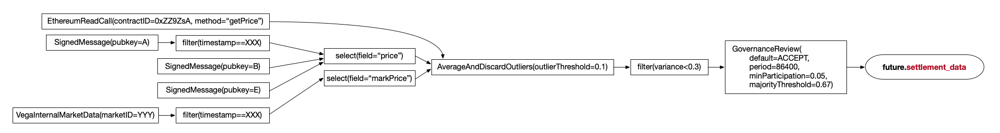

# Data sourcing

## 1. Principles and summary

The Vega network runs on data. Market settlement, risk models, and other features require different types of data (e.g. a supplied price, timestamps). The data is received from sources that are external or internal from the perspective of Vega network, and a variety of purposes require usage of internal and external components.

We consider `data` as _any_ type of submitted/delivered payload, examples including asset price, timestamp, orders, user data updates.

External sources bring data from the outside world via trustless or minimal-trust relationships with the Vega blockchain network. They can be blockchain bridges connected to external blockchain systems, oracle bridges, or oracles - services that feed data to the Vega network from external sources (APIs, any type of messaging/queue systems or any closed/open permissioned/permissionless centralised/decentralised systems).

The group of external data source entities comprises a separate _logical_ system layer, through which Vega network establishes a persistent inbound/outbound communication process with the outside world. Since the delivered data is external from the perspective of the Vega network, the relationship between the external data sources layer and Vega is trustless and is not related in any way to any type of consensus protocol used for internal Vega segments.

Data sources could be distributed entities themselves and/or (especially external ones) participate in distributed networks. In that case, they would operate and produce data via some consensus agreement, but that is not a concern for Vega network. Vega system, in any case, would use its own step for data verification, that is [signed messages](./0046-DSRM-data_source_signed_message.md)

Data sources, being external or internal, exist regardless of Vega internal engines operations. An internal engine would subscribe and unsubscribe to/from an external data source (bridge, oracle), but none of these actions would affect the existing and functioning of the data source entity.

a) The goals of Vega Protocol with regards to data sourcing are:

1. To provide access to data, being internal or external, to the Vega network in a standardised way, including data and triggers related to the "Vega Time" and market data (prices, etc.)
1. To support a wide range of third party data sourcing solutions for external data rather than to implement a complete solution in-house.
1. To be a source of deterministic data for Products and Risk Models that can be trusted by market participants.
1. To build simple, generic and anti-fragile data sourcing functionality without introducing third party dependencies.

b) Things that are explicitly NOT goals of the data sourcing framework at this time:

1. Calculations or processing of data other than selecting the value of a specific field and filtering events in the data stream are out of scope.
1. Processing arbitrary message formats is out-of-scope. Each required format should be specified explicitly. For instance we may specify that "Vega native protobuf message of key/value pairs" or "ABI encoded data in the OpenOracle format" must be valid data (and there may be more than one required format), but do not require general consumption of arbitrary data.
1. Whilst we do need to build a framework that will be _extensible_ with new sources and transformation/aggregation options, and _composable_ by combining options, we are not aiming to build a large library of such features for unproven use cases initially. The MVP can be built and will be very useful with a small number of features.

Note that this approach means:

1. Vega will not integrate directly with data providers at the protocol level. Rather, we provide APIs and protocol capabilities to support a wide range of data sourcing styles and standards (so that data sources that implement these standards will hopefully be compatible with little or no work).
1. External data sources must be able to provide a measure of finality that is either definitive or a configurable threshold on a probabilistic measure (‘upstream finality’).
1. Once upstream finality is achieved, Vega may in future provide optional mechanisms for querying, verification or dispute resolution that are independent of the source. These would be composable steps that could be added to any source.
`// TODO: Discuss how is this related to any potential consensus agreement on external data sources level - it is not related.``
1. Vega will allow composition of data sources, including those with disparate sources, and may in future provide a variety of methods to aggregate and filter/validate data provided by each. This takes into consideration the fact that external sources could be distributed entities themselves.

## 2. Data sourcing framework

Any part of Vega requiring a an external or internal data source should be able to use any type of data source. _This means that there is a single common method for specifying a data source where one is required._

The types of data sources that are supported are listed towards the end of this spec.

Data sources will be specified by providing:

1. Type of data source (signed message, internal Vega market data, date/time, Ethereum, etc.)
1. Data type (e.g. float for a price) - this must be compatible with the usage of the data source (if it is a settlement price, a numeric value would be required; for a trading termination trigger which consumes no data then any data type, etc.). Note that it is possible to have more than one "compatible" type, for instance it might be that a number could be a string or a raw numeric value in a JSON data source.
1. Data source specific details (for signed message, public key of sender; for Ethereum, contract address, method name; etc.)

Data sources may refer to other data sources, for example:

1. A data source that takes a source of structured data records as input and emits only the value of a named field (e.g. to return `BTCUSD_PRICE` from a record containing many prices, for instance)
1. A data source that takes another data source as input and emits only data that matches a set of defined filters (e.g. to return only records with specific values in the timestamp and ticket symbol fields)

NB: the above could be composed, so filter the stream and then select a field.

## 3. Specifying a new data source

When defining a data source, the specification for that data source must describe:

1. What parameters (input data) are required to create a data source of that type
1. How the data source interprets those parameters to emit one or more values
1. Any additional requirements needed for the data source to work (such as external "bridge" infrastructure to other blockchains)

## 4. Data types

### Allowable types

Data sources must be able to emit the following data types:

1. Number (for MVP these can be used for prices or in filter comparisons)
1. String (for MVP these would only be used to compare against in filters)
1. Date/Time (for MVP these would only be used to compare against in filters)
1. Structured data records i.e. a set of key value pairs (for MVP these would be inputs to filters)

Note that for number types the system should convert appropriately when these are used in a situation that requires Vega's internal price/quote type using the configured decimal places, etc. for the market.

Additionally, for number types where the data source value cannot be interpreted without decimal place conversion (e.g. it is a number from Ethereum represented as a very large integer, perhaps as a string, with 18 or some other number of implicit decimals), it must be possible to specify the number of implicit decimals, when specifying the data source (e.g. in a market proposal or wherever the data source is to be used). Strings and numbers with decimal points and numbers after them should be interpreted correctly.

For example: this means that if a data source with specified 18 decimal places is used to settle a market with 4 market decimals then:

- Data with a value of `103500000000000000000` implies an actual value of `103.5`
- This value would end up being represented on Vega as `1035000`

Vega should support sufficient number types to enable processing of any reasonably expected message for each format. For instance if we are building JSON we might expect both Number and String fields to be allowable.

In future there will likely be other types.

### Type checking

The context in which the data source is used can determine the type of data required to be received. Data sources that emit data of an incorrect type to a defined data source should trigger an event or log of some sort (the type may depend if this is detected within processing of a block or before accepting a tx). If the error is detected synchronously on submission, the error message returned by the node should explicitly detail the issue (i.e. what mismatched, how, and in what part of what data source definition it occurred).

For [futures](./0016-PFUT-product_builtin_future.md) the data type expected will  be a number ("price"/quote) for settlement, and any event for the trading terminated trigger. For filtered data, the input data source can be any type and the output must be the type required by the part of the system using the data source.

## 5. Selecting a field

Often, a data source will provide a set of key/value pairs when what is needed is a single value from the object. therefore a data source may be defined that takes another source as input and selects the value of one field.

The definition of such a source may look like:

```rust
select: {
  field: 'price',
  data: << input data source >>
}
```

This would emit just the value of the price field, i.e.

```json
{ "ticker": "GOLD", "price": 27.2 }
```

The above JSON gives output of `27.2`.

## 6. Types of data source

The following data sources have been defined:

1. [Internal basic data sources](./0048-DSRI-data_source_internal.md)
1. [signed message](./0046-DSRM-data_source_signed_message.md)
1. [Filters](./0047-DSRF-data_source_filter.md) (exclude certain events based on conditions and boolean logic against the fields on the data such as equals, simple comparisons). An MVP of this functionality is needed to allow signed message data sources to be practical, more complex filters are included in the "future work" section below.

Future (needed sooner than the others listed in 9 below):

1. Ethereum oracles (events, contract read methods)
1. Repeating time triggers
1. Vega market data (i.e. prices from other markets on Vega)

## 7. Tracking active data sources

Vega will need to keep track of all "active" defined data sources that are referenced either by markets that are still being managed by the core (i.e. excluding Closed/Settled/Cancelled/other "end state" markets) or by other data source definitions (see each individual data source definition spec, such as [signed message](./0046-DSRM-data_source_signed_message.md) for this specific information).

Vega should consider the specific definition including filters, combinations etc. not just the primary source. So, for example, if two markets use the same signing key(s)/addresses (signers) but different filters or aggregations etc. then these constitute two different data sources and each transaction that arrives signed by these signers should only be accepted if one or more of these specific active data sources "wants" the data.

Data sources that are no longer active as defined above will be ignored, as well as any incoming data that is not emitted by an active data source (i.e. passes all filters etc. as well as matching the public key, event name, or whatever).

## 8. APIs

APIs should be available to:

1. List active data sources and their configuration
1. Emit an event on the event bus when a data source value is emitted.

## 9. Future work

The following are expected to be implemented in future.

1. New base data source types:
    1. Internal market parameters
    1. Internal market data (prices)
    1. Internal network parameters and metrics
    1. Signed or validator verified HTTPS endpoints
    1. Other blockchains that we bridge to
    1. Other formats for messages received via, e.g. signed data sources/HTTPS/... (e.g. JSON)
1. Composable modifiers/combinators for data sources:
    1. Repeating time triggers (every n hours, every dat at 14:00, etc.)
    1. Aggregation (m of n and/or averaging, etc.) of multiple other data sources
    1. Verification of outputs of another data source by governance vote
    1. Calculations (i.e. simple maths/stats plus access to quant library functions, product valuation function, including reference to product parameters or arbitrary other data sources)
    1. Additional filter conditions

In future, we would therefore expect arbitrary compositions of these features to allow market designers to design robust and useful data sources. An visual example of a data source "pipeline" / definition that might eventually be used is below:



## Examples

Here are some examples of how a data source might be specified.

Note that these are examples _not actual specs_, please see specs for currently specified data types!

Signed message stream filtered to return a single value:

```proto
select: {
  field: 'price',
  data: {
    filteredData: {
      filters: [
    -   { 'field': 'feed_id', 'equals': 'BTCUSD/EOD' },
        { 'field': 'mark_time', 'equals': '31/12/20' }
      ],
      data: {
        signedMessage: {
          sourcePubkeys: ['VEGA_PUBKEY_HERE', ...],
          dataType: { type: 'decimal', places: 5 }
        }
      }
    }
  }
}
```

Simple value, emitted at a date/time:

```proto
on: {
  timestamp: '2021-01-31T23:59:59Z',
  data: {
    value { value: 0.2, type: 'float', }
  }
}
```

Empty value, trigger only, i.e. trigger trading terminated at a date/time for futures:

```proto
on: { timestamp: '2021-01-31T23:59:59Z' }
```

In future: value from a read only call on Ethereum

```proto
ethereumCall: {
  at: '2021-01-31T23:59:59Z',
  contractAddress: '0x1f9840a85d5aF5bf1D1762F925BDADdC4201F984',
  ABI: '...ABI...BLAH...'
  method: 'getPrice'
  params: []
}
```

## Acceptance criteria

Vega should reject any data source tx that is not explicitly required, so this would include a tx:

1. If a data source combines a primary source (like a signed message) with a filter (for instance saying we are only interested in messages where ticker = `GBPUSD` and timestamp = `20211231T23:59:00`) then the complete data source definition defines the source and can be used to accept/reject transactions, so for an active data source is active, transactions from the same provider (pubkey, Ethereum contract/event, URL, etc.) do not form part of the defined data source. If submitted, they should be rejected where possible and must not supply data to the target for the data source if the metadata or data content itself is not selected by the source definition (e.g. because ticker and timestamp do not match a filter). (<a name="0045-DSRC-001" href="#0045-DSRC-001">0045-DSRC-001</a>)
1. When no reference to a data source remains in any active part of the system (for instance a non-cancelled/settled market), data source no longer needs to be tracked and can be discarded. Any transactions that would previously have matched and been selected by that data source would be rejected/ignored. (<a name="0045-DSRC-002" href="#0045-DSRC-002">0045-DSRC-002</a>)
1. If the same complete data source (provider and filters, etc.) is referenced in multiple places (e.g. two separate active markets) then it will remain active if any subset of those references remain active. For example 2 markets reference the same data source (full definition must match exactly) and one of those markets is closed/cancelled/settled before the other, either because some other difference in their definition or because of governance action. (<a name="0045-DSRC-003" href="#0045-DSRC-003">0045-DSRC-003</a>)
1. If multiple data sources share common roots (e.g. the same provider - pubkey etc. but different filters) and at least one of those sources filters out a transaction but at least one other selects it (all filters match), the transaction data must still be supplied for the sources that match and must not be supplied for the sources that don't match. (<a name="0045-DSRC-004" href="#0045-DSRC-004">0045-DSRC-004</a>)
1. If multiple data sources share common roots (e.g. the same provider - pubkey etc. but different filters) and all of the sources select it (all filters match), the transaction data must be supplied for ALL of the sources that match. (<a name="0045-DSRC-005" href="#0045-DSRC-005">0045-DSRC-005</a>)
1. If a data source reference is changed (e.g. via governance vote), the old source must be dropped and data/transactions matching that source must not reach the target. (<a name="0045-DSRC-006" href="#0045-DSRC-006">0045-DSRC-006</a>)
1. If a data source reference is changed (e.g. via governance vote), the new source must become active and data/transactions matching that source must reach the target. (<a name="0045-DSRC-007" href="#0045-DSRC-007">0045-DSRC-007</a>)
1. Changes in data source references (e.g. via governance vote) must allow changing between any valid data source definitions, including to a data source of a different type of data source. (<a name="0045-DSRC-008" href="#0045-DSRC-008">0045-DSRC-008</a>)
1. Data is not applied retrospectively, i.e. if a previous historic data point or data transaction would have matched a newly created data source, it must not be identified and applied to the new data source (and therefore need not be stored by the core), only active data and new events created after the activation of the data source would be considered for the source. (<a name="0045-DSRC-009" href="#0045-DSRC-009">0045-DSRC-009</a>)
1. Two data sources with the same definition that are active at the same time must always select and receive exactly the same data, in the same order. (<a name="0045-DSRC-010" href="#0045-DSRC-010">0045-DSRC-010</a>)
1. Rejection of data sources either before submission/sequencing as transactions or when/if data is filtered/rejected after being sequenced on chain (if this happens - it should be avoided wherever possible to prevent spam attacks and reduce network load) must either result in an event queue message, return an error to the client, or enable the rejection (or not) to be confirmed by querying a core API (e.g. the filter, selector, or type check that failed). (<a name="0045-DSRC-011" href="#0045-DSRC-011">0045-DSRC-011</a>)
1. It's possible to query an API and see all active data sources. (<a name="0045-DSRC-012" href="#0045-DSRC-012">0045-DSRC-012</a>)
1. Party submitting an oracle transaction that gets rejected (e.g. because no data source is listening for transactions from such key) can receive an error message detailing reason for rejection. (<a name="0045-DSRC-013" href="#0045-DSRC-013">0045-DSRC-013</a>)
1. It's possible to listen to events and see all data that is supplied across all data sources or for any specific source. (<a name="0045-DSRC-014" href="#0045-DSRC-014">0045-DSRC-014</a>)
1. Data node carries historic data of at least all valid data that was supplied for each data source. (<a name="0045-DSRC-015" href="#0045-DSRC-015">0045-DSRC-015</a>)
1. Data sources can be composed/nested arbitrarily (as long as the definition is valid), for example selecting a field on filtered data that itself was sourced by selecting a field on a message sent by a signed data source (for example this might be processing a complex object in the source data). (<a name="0045-DSRC-016" href="#0045-DSRC-016">0045-DSRC-016</a>)
1. A market proposal specifies data source where value used for settlement is integer with implied decimals; the implied decimals are included in the oracle spec; once trading terminated and settlement data is submitted the price is interpreted correctly for settlement purposes. E.g. market decimals `1`, market uses asset for settlement with `10` decimals, oracle implied decimals `5`, submitted value `10156789` interpreted as `101.56789`. In asset decimals this is `1015678900000` and this is used for settlement.  (<a name="0045-DSRC-017" href="#0045-DSRC-017">0045-DSRC-017</a>)
1. Data source transactions can be submitted by a party with zero balance in all assets. (<a name="0045-DSRC-018" href="#0045-DSRC-018">0045-DSRC-018</a>)
1. After trading termination has been triggered the trading terminated data source is no longer active (assuming it is not used anywhere else) and data from that source is no longer processed (<a name="0045-DSRC-019" href="#0045-DSRC-019">0045-DSRC-019</a>)
1. After settlement data has been received and the market has settled, the settlement data source is no longer active (assuming it is not used anywhere else) and data from that source is no longer processed (<a name="0045-DSRC-020" href="#0045-DSRC-020">0045-DSRC-020</a>)
1. Where the same oracle definition is used for trading terminated and settlement, and data has been received. Trading is terminated and the market is settled with the same data event (a single message does both). The data source is no longer active (assuming it is not used anywhere else) and data from that source is no longer processed. (<a name="0045-DSRC-021" href="#0045-DSRC-021">0045-DSRC-021</a>)
1. It should be possible to update the market termination spec from external to internal and prove that the original termination key and filter no longer supports termination and that the updated market termination key and filter supports termination. This should apply to filter key types Timestamp/Boolean and Integer. (<a name="0045-DSRC-022" href="#0045-DSRC-022">0045-DSRC-022</a>)
1. It should be possible to update the market termination spec from internal to external and prove that the original termination key and filter no longer supports termination and that the updated market termination key and filter supports termination. This should apply to filter key types Timestamp/Boolean and Integer. (<a name="0045-DSRC-023" href="#0045-DSRC-023">0045-DSRC-023</a>)
1. It should not be possible to update the market settlement data spec to change the type from an external data source to an internal Vega timestamp data source. NB: this is because the internal Vega timestamp data source does not emit a value that can be used as a price, only a date/time. (<a name="0045-DSRC-024" href="#0045-DSRC-024">0045-DSRC-024</a>)
1. When using the update market transaction to switch between oracle types the protocol should identify invalid supplied combinations of data source data and reject the transaction via an appropriate message either within the rejected proposal or via the wallet response. (<a name="0045-DSRC-025" href="#0045-DSRC-025">0045-DSRC-025</a>)
