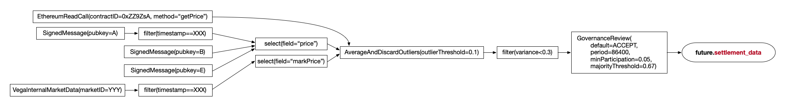

# Data sourcing (aka oracles)

## 1. Principles and summary

The Vega network runs on data. Market settlement, risk models, and other features require a supplied price (or other data), which must come from somewhere, often completely external to Vega. This necessitates the use of both internal and external data sources for a variety of purposes.


a) The goals of Vega Protocol with regards to data sourcing are:

1. To provide access to data internal to the Vega network in a standardised way, including data and triggers related to the "Vega Time" and market data (prices, etc.)
1. To support a wide range of third party data sourcing solutions for external data rather than to implement a complete solution in-house.
1. To be a source of definitive and final data to Products and Risk Models that can be trusted by market participants.
1. To build simple, generic and anti-fragile data sourcing functionality, and not to introduce third party dependencies.

b) Things that are explicitly NOT goals of the data sourcing framework at this time:

1. Calculations or processing of data other than selecting the value of a specific field and filtering events in the data stream are out of scope.
1. Processing arbitrary message formats is out-of-scope. Each required format should be specified explicitly. For instance we may specify that "Vega native protobuf message of key/value pairs" or "ABI encoded data in the OpenOracle format" must be valid data (and there may be more than one required format), but do not require general consumption of arbitrary data.
1. Whilst we do need to build a framework that will be *extensible* with new sources and transformation/aggregation options, and *composable* by combining options, we are not aiming to build a large library of such features for unproven use cases initially. The MVP can be built and will be very useful with a small number of features.


Note that this approach means:

1. Vega will not integrate directly with specific oracle/data providers at the protocol level. Rather, we provide APIs and protocol capabilities to support a wide range of data sourcing styles and standards (so that oracles implementing these standards will hopefully be compatible with little or no work).
1. External data sources must be able to provide a measure of finality that is either definitive or a configurable threshold on a probabilistic measure (‘upstream finality’).
1. Once upstream finality is achieved, Vega may in future provide optional mechanisms for querying, verification or dispute resolution that are independent of the source. These would be composable steps that could be added to any source.
1. Vega will allow composition of data sources, including those with disparate sources, and may in future provide a variety of methods to aggregate and filter/validate data provided by each. 


## 2. Data sourcing framework

Any part of Vega requiring a data source should be able to use any type of data source. **This means that there is a single common method for specifying a data source where one is required.**

The types of data sources that are supported are listed towards the end of this spec. 

Data sources will be specified by providing:

1. Type of data source (signed message, internal Vega market data, date/time, Ethereum, etc.)
1. Data type (e.g. float for a price) - this must be compatible with the usage of the data source (if it is a settlement price, a numeric value would be required; for a trading termination trigger which consumes no data then any data type, etc.). Note that it is possible to have more than one "compatible" type, for instance it might be that a number could be a string or a raw numeric value in a JSON data source.
1. Data source specific details (for signed message, public key of sender; for Ethereum, contract address, method name; etc.)

Data sources may refer to other data sources, for example:
1. A data source that takes a source of structured data records as input and emits only the value of a named field (e.g. to return "BTCUSD_PRICE" from a record containing many prices, for instance)
1. A data source that takes another data source as input and emits only data that matches a set of defined filters (e.g. to return only records with specific values in the timestamp and ticket symbol fields)

NB: the above could be composed, so filter the stream and then select a field. 


## 3. Specifying a new data source

When defining a data source, the specification for that data source must describe:
1. What parameters (input data) are required to create a data source of that type
1. How the data source interprets those parameters to emit one or more values
1. Any additional requirements needed for the data source to work (such as external "bridge" infrastructure to other blockchains)


## 4. Data types


### Allowable types:

Data sources must be able to emit the following data types:
1. Number (for MVP these can be used for prices or in filter comparisons)
1. String (for MVP these would only be used to compare against in filters)
1. Date/Time (for MVP these would only be used to compare against in filters)
1. Structured data records i.e. a set of key value pairs (for MVP these would be inputs to filters)

Note that for number types the system should convert appropriately when these are used in a situation that requires Vega's internal price/quote type using the configured decimal places, etc. for the market.

Vega should support sufficient number types to enable processing of any reasonably expected message for each format. For instance if we are building JSON we might expect both Number and String fields to be allowable.

In future there will likely be other types.


### Type checking

The context in which the data source is used can determine the type of data required to be received. Data sources that emit data of an incorrect type to a defined data source should trigger an event or log of some sort (the type may depend if this is detected within processing of a block or before accepting a tx). If the error is detected synchronously on submission, the error message returned by the node should explicitly detail the issue (i.e. what mismatched, how, and in what part of what data source definition it occurred).

For [futures](./0016-product-builtin-future.md) the data type expected will  be a number ("price"/quote) for settlement, and any event for the trading terminated trigger. For filtered data, the input data source can be any type and the output must be the type required by the part of the system using the data source.


## 5. Selecting a field 

Often, a data source will provide a set of key/value pairs when what is needed is a single value from the object. therefore a data source may be defined that takes another source as input and selects the value of one field.

The definition of such a source may look like:

```rust
select: {
  field: 'price',
  data: << input data source >>
}
```

This would emit just the value of the price field, i.e. 

```json
{ "ticker": "GOLD", "price": 27.2 } 
```
The above JSON gives output of `27.2`.

## 6. Types of data source

The following data sources have been defined:
1. [Internal basic data sources](./0048-data-source-internal.md)
1. [signed message](./0046-data-source-signed-message.md)
1. [Filters](./0047-data-source-filter.md) (exclude certain events based on conditions and boolean logic against the fields on the data such as equals, simple comparisons). An MVP of this functionality is needed to allow signed message data sources to be practical, more complex filters are included in the "future work" section below.

Future (needed sooner than the others listed in 9 below)
1. Ethereum oracles (events, contract read methods)
1. Repeating time triggers
1. Vega market data (i.e. prices from other markets on Vega)


## 7. Tracking active data sources

Vega will need to keep track of all "active" defined data sources that are referenced either by markets that are still being managed by the core (i.e. excluding Closed/Settled/Cancelled/other "end state" markets) or by other data source definitions (see each individual data source definition spec, such as [signed message](./0046-data-source-signed-message.md) for this specific information).

Vega should consider the specific definition including filters, combinations etc. not just the primary source. So, for example, if two markets use the same public key(s) but different filters or aggregations etc. then these constitute two different data sources and each transaction that arrives signed by these public keys should only be accepted if one or more of these specific active data sources "wants" the data.

Data sources that are no longer active as defined above can be discarded. Incoming data that is not emitted by an active data source (i.e. passes all filters etc. as well as matching the public key, event name, or whatever) can be ignored. 


## 8. APIs

APIs should be available to:
1. List active data sources and their configuration
1. Emit an event on the event bus when a data source value is emitted.


## 9. Future work

The following are expected to be implemented in future.

a) New base data source types:
1. Internal market parameters
1. Internal market data (prices)
1. Internal network parameters and metrics
1. Signed or validator verified HTTPS endpoints
1. Other blockchains that we bridge to
1. Other formats for messages received via, e.g. signed data sources/HTTPS/... (e.g. JSON)

b) Composable modifiers/combinators for data sources:
1. Repeating time triggers (every n hours, every dat at 14:00, etc.)
1. Aggregation (m of n and/or averaging, etc.) of multiple other data sources
1. Verification of outputs of another data source by governance vote
1. Calculations (i.e. simple maths/stats plus access to quant library functions, product valuation function, including reference to product parameters or arbitrary other data sources)
1. Additional filter conditions

In future, we would therefore expect arbitrary compositions of these features to allow market designers to design robust and useful data sources. An visual example of a data source "pipeline" / definition that might eventually be used is below:




## Examples

Here are some examples of how a data source might be specified. 

Note that these are examples *not actual specs*, please see specs for currently specified data types! 

Signed message stream filtered to return a single value:
```
select: {
  field: 'price',
  data: {
    filteredData: {
      filters: [ 
    -   { 'field': 'feed_id', 'equals': 'BTCUSD/EOD' },
        { 'field': 'mark_time', 'equals': '31/12/20' }
      ],
      data: { 
        signedMessage: {
          sourcePubkeys: ['VEGA_PUBKEY_HERE', ...],
          dataType: { type: 'decimal', places: 5 }
        }
      }
    } 
  }
}
```

Simple value, emitted at a date/time:
```
on: { 
  timestamp: '2021-01-31T23:59:59Z', 
  data: { 
    value { value: 0.2, type: 'float', } 
  }
}
```

Empty value, trigger only, i.e. trigger trading terminated at a date/time for futures:
```
on: { timestamp: '2021-01-31T23:59:59Z' }
```


In future: value from a read only call on Ethereum
```
ethereumCall: {
  at: '2021-01-31T23:59:59Z',
  contractAddress: '0x1f9840a85d5aF5bf1D1762F925BDADdC4201F984',
  ABI: '...ABI...BLAH...'
  method: 'getPrice'
  params: []
}
```


# Acceptance criteria

Vega should reject any data source tx that is not explicitly required, so this would include a tx:

- If a data source combines a primary source (like a signed message) with a filter (for instance saying we are only interested in messages where ticker = GBPUSD and timestamp = 20211231T23:59:00) then the complete data source definition defines the source and can be used to accept/reject transactions, so even if this data source is active, transactions from the same pubkey would be rejected if the ticker and timestamp were not correct, then the whole data source would be discarded once it is no longer referenced by a market


