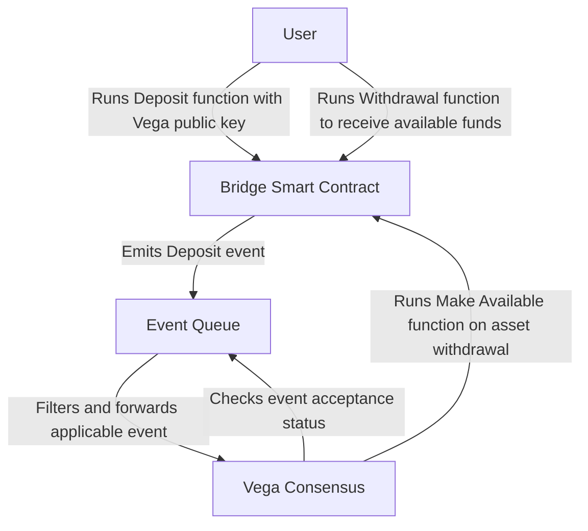

Feature name: feature-name
Start date: YYYY-MM-DD
Specification PR: https://gitlab.com/vega-protocol/product/merge_requests

# Acceptance Criteria
Check list of statements that need to met for the feature to be considered correctly implemented.

# Summary
In order to integrate Vega with various external blockchains and oracles, we’ve determined that a set of “bridge” smart contracts along with an ‘event queue’ process to find and propagate applicable on-chain events is necessary for the deposit and withdrawal of funds/assets from Vega. This, collectively, is named the Vega Ramp as it is the on- and off-ramp of all assets regardless of chain of origin.


# Guide-level explanation
## On Chain Event Recording
In order to enable decentralized and secure depositing and withdrawal of funds, we have created a series of “bridge” smart contracts. These bridges each target a specific asset type, such as ETH or ERC20 tokens, and expose simple functionality to allow the Vega network to accept deposits, hold, and then release assets as needed. This immutably records all deposits and withdrawals for all of the assets that Vega markets use.
Each bridge contains 3 primary functions and emits 3 primary events, each tailored to the asset type. They are deposit, make available, and withdraw and the corresponding events of available, deposited, withdrawn. Deposit is run by a user or process and ensures that the asset is stored safely on-contract and then emits the deposited event. Make available is run by the Vega network and makes the given amount of the asset available to a user for withdrawal, this emits the available event. The withdrawal function is run by the user or process credited by “make available” to withdraw the asset from the contract.
Each bridge limits the ability to make more assets available to users than it has on-contract and has already promised. This means that even in the event of a compromise, the damage is limited.


## Off Chain Event Post Processing and Propagation
Latency and throughput is of paramount importance to Vega validator nodes, so monitoring various 3rd party (and notably low transaction speed) blockchains and crypto-assets isn’t possible. To counter this problem we have created an event queue management system. This event queue uses a set of asset busses that allow the standardization, storing and propagation of transactions from 3rd party asset chains into the Vega oracle format. Once the events and transactions are gathered and processed, only the ones important to our system will be propagated through consensus and thus need to be validated by the validator node. This makes the event queue work as a buffer between the slow/complicated world of various blockchains, and the high throughput, low latency of Vega Core.
This message queue will use grpc to communicate with the Vega network via 2 main functions: Propagate_Oracle_Event and Oracle_Event_Acceptance_Status. The first: Propagate_Oracle_Event  allows an event queue to send oracle events (events, transactions, setting changes, etc) through Vega consensus to ensure an event has been seen by the network. Each validator will individually process and validate the given transaction but only parse for the specified event reported.
The second function, Oracle_Event_Acceptance_Status, returns the consensus acceptance status of a given transaction/event. The event queue uses this function to determine if it should attempt to send the event again.


# Reference-level explanation



### Bridges
For each asset class, there is a bridge smart contract. Currently all contracts are Ethereum-based assets, namely Ether, ERC20 tokens, ERC721 nonfungible tokens, ERC1155 crypto items, and Oracle Controlled Assets (assets that are reported by an authority). Each asset class will receive a bridge contract on the appropriate platform (ETH, EOS, Tron, etc). 
Each bridge implements a standard interface:
```
contract IVega_Bridge {
    //TODO: add pricing functions
    //TODO: add asset registration

    event Asset_Available(address indexed user_address, address indexed asset_source, uint256 indexed asset_id, uint256 amount, bytes32 unique_id);
    event Asset_Withdrawn(address indexed user_address, address indexed asset_source, uint256 indexed asset_id, uint256 amount);
    event Asset_Deposited(address indexed user_address, address indexed asset_source, uint256 indexed asset_id, uint256 amount, bytes vega_public_key);
    event Asset_Deposit_Minimum_Set(address indexed asset_source, uint256 indexed asset_id, uint256 new_minimum);

    function make_asset_available(address user_address, address asset_source, uint256 asset_id, uint256 amount, bytes32 unique_id) public;

    // VIEWS /////////////////
    function is_unique_id_used(bytes32 unique_id) public view returns(bool);
    function get_asset_promised_total(address asset_source, uint256 asset_id) public view returns(uint256);
    function get_asset_available_for_user(address user, address asset_source, uint256 asset_id) public view returns(uint256);
    function get_deposit_minimum(address asset_source, uint256 asset_id) public view returns(uint256);


}
```

### Deposits
Deposits happen when a users fun the deposit function of a bridge contract for a given asset. Once this is executed on-chain, an event is raised from the Ethereum protocol. This event is processed by the event queue and passed to Vega Consensus. Each node recieves notice of the event either from the Event Queue or through inter-node gossip and validates the transaction for itself on its local external blockchain node (such as Geth, Parity, etc). This necessitates each node to either run a given blockchain node locally or have a trusted source to the node.

### Withdrawals 
Withdrawals happen when a user decides to withdrawal funds from Vega and/or Vega consensus decides to make funds available to a user. When this happens, the nodes either sign a command to run the 'make available' function on the appropriate bridge smart contract using TSS or begin a multi-signature process to run the command. This makes assets available to a user's given wallet address. Once funds are available to a user, the user can run the 'withdrawal' function on the appropriate smart contract that will transfer the funds from the smart contract to the wallet.

### Oracle Controlled Assets
An Oracle Controlled Asset is one where a deposit or withdrawal is recorded by the oracle/authority on the bridge. Once a deposit is recorded, the balance is under the control of the bridge/Vega consensus and is a method of accounting and keeping the authority honest.

# Pseudo-code / Examples
```
enum Event_Types {
    UNKNOWN = 0;
    Asset_Made_Available=1;
    Asset_Deposited=2;
    Asset_Withdrawn=3;
    Transaction=4;
    Settings_Change=5;
    Ballot_Proposed=7;
    Ballot_Cast=8;
    Price_Updated=9;
    Asset_Listed=10;
    Asset_Delisted=11;
    //TODO: add more
}
```

```
message Oracle_Event_Propagation_Request {
        string oracle_source = 1; //address of oracle
        string asset_source = 2; //asset source according to that oracle
        string asset_id = 3; //ID of asset specific to that asset_source
        Event_Types event_type = 4; // enumerated event type
        string source_party_id = 5; // source ethereum address 20 bytes hex preceded by 0x or other party ID of user/contract/system this pertains to
        string target_party_id = 6; // provided public key on party to target the event to
        string transaction_hash = 7; // tx hash in question that must lead us to parseable data based on 'event_type'
        uint32 log_index = 8; // if the transaction outputs multiple events to the log, this tells you which one
        string event_name = 9; // friendly name of event specific to bridge/source
        uint32 block_number = 10; // block number of source chain the event occurred 
}
```

# Test cases
Some plain text walkthroughs of some scenarios that would prove that the implementation correctly follows this specification.
