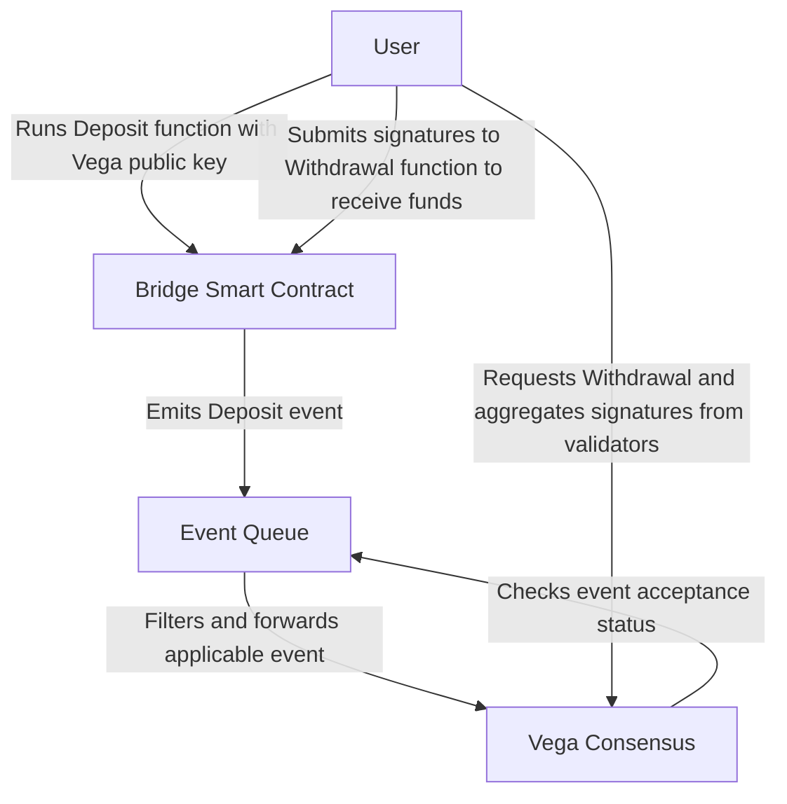

Feature name: feature-name
Start date: YYYY-MM-DD
Specification PR: https://gitlab.com/vega-protocol/product/merge_requests


# Summary
In order to integrate Vega with various external blockchains to allow the deposit and withdrawal of settlement instruments (assets) into and out of the Vega network, we’ve determined that a set of “bridge” smart contracts along with an ‘event queue’ process to find and propagate applicable on-chain events is necessary for the deposit and withdrawal of funds/assets from Vega. This, collectively, is named the Vega Ramp as it is the on- and off-ramp of all assets regardless of chain of origin. This spec coveres the bridges.


# Guide-level explanation
## On Chain Event Recording
In order to enable decentralized and secure depositing and withdrawal of funds, we have created a series of “bridge” smart contracts. These bridges each target a specific asset class, such as ETH or ERC20 tokens, and expose simple functionality to allow the Vega network to accept deposits, hold, and then release assets as needed. This immutably records all deposits and withdrawals for all of the assets that Vega markets use, as well as any governance pertaining to the bridge smart contracts.
Each bridge contains two primary functions and emits two primary events, each tailored to the asset class. They are deposit and withdraw and the corresponding events of deposited and withdrawn. Deposit is ran by a user or process and ensures that the asset is stored safely on-contract and then emits the deposited event. The withdrawal function itself is run by the user or process once signatures have been aggregated from validator nodes. This multisig aggregation is out of the scope of this specification and will be covered elsewhere.


# Reference-level explanation



### Bridges
For each asset class, there is a bridge smart contract. Currently all contracts are Ethereum-based assets, namely Ether and ERC20 tokens. In the future ERC721 nonfungible tokens, ERC1155 crypto items, and Oracle Controlled Assets (assets that are reported by an authority) and other asset classes will be added. Each asset class will receive a bridge contract on the appropriate platform (ETH, EOS, Tron, etc).

Each bridge implements a standard interface (Ethereum shown here):
```go
pragma solidity ^0.5.0;


contract IVega_Bridge {

    event Asset_Withdrawn(address indexed user_address, address indexed asset_source, uint256 indexed asset_id, uint256 amount);
    event Asset_Deposited(address indexed user_address, address indexed asset_source, uint256 indexed asset_id, uint256 amount, bytes vega_public_key);
    event Asset_Deposit_Minimum_Set(address indexed asset_source, uint256 indexed asset_id, uint256 new_minimum);
    event Asset_Whitelisted(address indexed asset_source, uint256 indexed asset_id);
    event Asset_Blacklisted(address indexed asset_source, uint256 indexed asset_id);

    function whitelist_asset(address asset_source, uint256 asset_id, uint256 nonce, bytes memory signatures) public;
    function blacklist_asset(address asset_source, uint256 asset_id, uint256 nonce, bytes memory signatures) public;
    function set_deposit_minimum(address asset_source, uint256 asset_id, uint256 minimum_amount) public;
    function withdraw_asset(address asset_source, uint256 asset_id, uint256 amount, uint256 nonce, bytes memory signatures) public;
    function deposit_asset(address asset_source, uint256 asset_id, uint256 amount, byte32 vega_public_key) public;
    
    // VIEWS /////////////////
    function is_asset_whitelisted(address asset_source, uint256 asset_id) public view returns(uint256);
    function is_nonce_used(uint nonce) public view returns(bool);
    function get_deposit_minimum(address asset_source, uint256 asset_id) public view returns(uint256);


}

```

### Deposits
Deposits happen when a user runs the deposit function of a bridge contract for a given asset. Once this is executed on-chain, an event is raised from the Ethereum protocol. This event is processed by the event queue (covered in another spec) which passes the event to Vega Consensus. Each node recieves notice of the event either from the Event Queue or through inter-node gossip and validates the transaction for itself on its local external blockchain node (such as Geth, Parity, etc). This necessitates each node to either run a given blockchain node locally or have a trusted source to the node.

### Withdrawals 
Withdrawals happen when a user decides to withdrawal funds from Vega and/or Vega consensus decides release an asset to a user. When this happens, the client aggregates signatures from the validator nodes (covered elsewhere). Once a threshold of signatures is reached, the client runs the `withdraw_asset` command while providing the bundle of authorized signatures.


# Pseudo-code / Examples
```go
enum Event_Types {
    UNKNOWN = 0;
    Asset_Deposited=1;
    Asset_Withdrawn=2;
    Asset_Listed=3;
    Asset_Delisted=4;
    Deposit_Minimum_Set=5;
}
```

```go
message Oracle_Event_Propagation_Request {
        string oracle_source = 1; //address of oracle
        string asset_source = 2; //asset source according to that oracle
        string asset_id = 3; //ID of asset specific to that asset_source
        Event_Types event_type = 4; // enumerated event type
        string source_party_id = 5; // source ethereum address 20 bytes hex preceded by 0x or other party ID of user/contract/system this pertains to
        string target_party_id = 6; // provided public key on party to target the event to
        string transaction_hash = 7; // tx hash in question that must lead us to parseable data based on 'event_type'
        uint32 log_index = 8; // if the transaction outputs multiple events to the log, this tells you which one
        string event_name = 9; // friendly name of event specific to bridge/source
        uint32 block_number = 10; // block number of source chain the event occurred 
}
```

# Acceptance Criteria

## Deposit
*  A bridge smart contract for Ethereum is deployed to Ethereum Testnet (tbd - ropsten?)
*  A bridge smart contract for ERC20 is deployed to Ethereum Testnet (tbd - ropsten?)
*  ETH smart contract
** A multisig bundle can be passed to the setMinimum function to successfully update the minimum deposit size
** An Ethereum Address can call the deposit function and successfully deposit Ethereum, as long as it is above the minimum size deposit
** A request to deposit any non-Ethereum asset is rejected
** A deposit call that is below the minimum size is rejected

* ERC20 smart contract (This can be repeated for many token standards - NFTs and crypto items will be more complex)
** A valid multisig bundle can be passed to the setMinimum function to successfully update the minimum deposit size for a whitelisted token
** A valid multisig bundle can not be passed to the setMinimum function for a token that is not whitelisted
** An Ethereum Address can call the deposit function and successfully deposit any whitelisted token, as long as it is above the minimum size deposit
** A deposit call with a blacklisted token is rejected
** A deposit call with a non-whitelisted token is rejected
** A deposit call with a whitelisted token that is below the minimum size is rejected

## Withdraw
* ETH smart contract
** A valid multisig bundle can be passed to the withdraw function to successfully withdraw ETH
** An  invalid multisig bundle will be rejected from withdraw
* ERC20 smart contract
** A valid multisig bundle can be passed to the withdraw function to successfully withdraw ETH
** An invalid multisig bundle will be rejected from withdraw

## Whitelist a token (by eth address)

* A bridge smart contract for ERC20 is deployed to Ethereum Testnet (tbd - ropsten?)
* ERC20 smart contract
** A valid multisig bundle can be passed to the whitelistToken function to successfully add a token to the whitelist
** An invalid multisig bundle is rejected by the whitelistToken function

## Blacklist a token (by eth address)
* A bridge smart contract for ERC20 is deployed to Ethereum Testnet (tbd - ropsten?)
* ERC20 smart contract
** A valid multisig bundle can be passed to the blacklistToken function to successfully remove a previously whitelisted token
** An invalid multisig bundle is rejected by the blacklistToken function

## Set deposit minimum
*  A bridge smart contract for Ethereum is deployed to Ethereum Testnet (tbd - ropsten?)
*  A bridge smart contract for ERC20 is deployed to Ethereum Testnet (tbd - ropsten?)
*  A valid multisig bundle can be passed to the setDepositMinimum function to successfully set a deposit minimum for a given asset
*  an invalid multisig bundle is rejected by the setDepositMinimum function


#TODO:
* Create event queue spec
* Create Multisig spec
