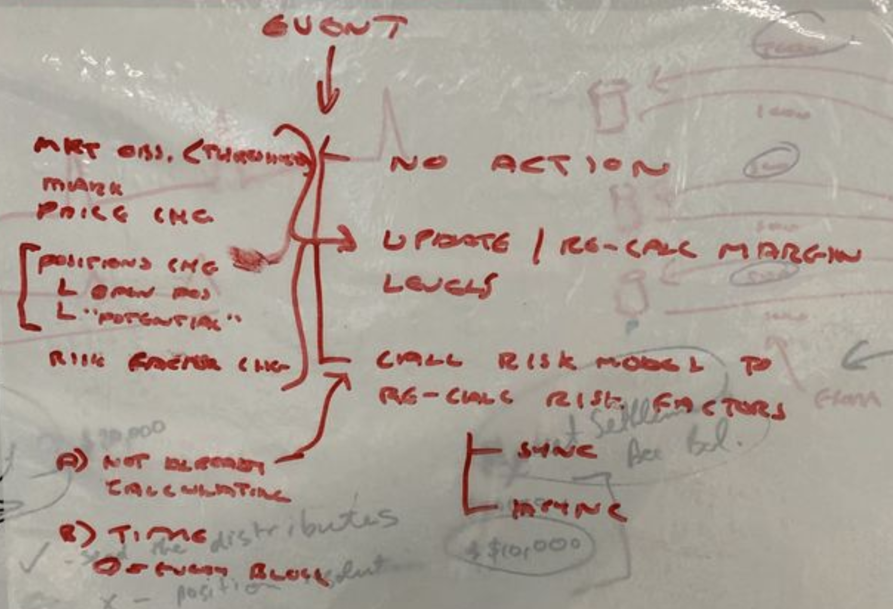
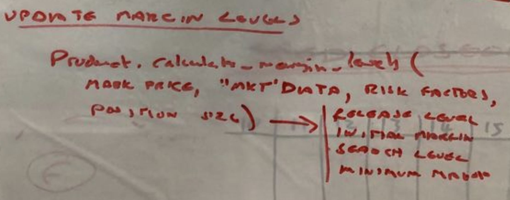
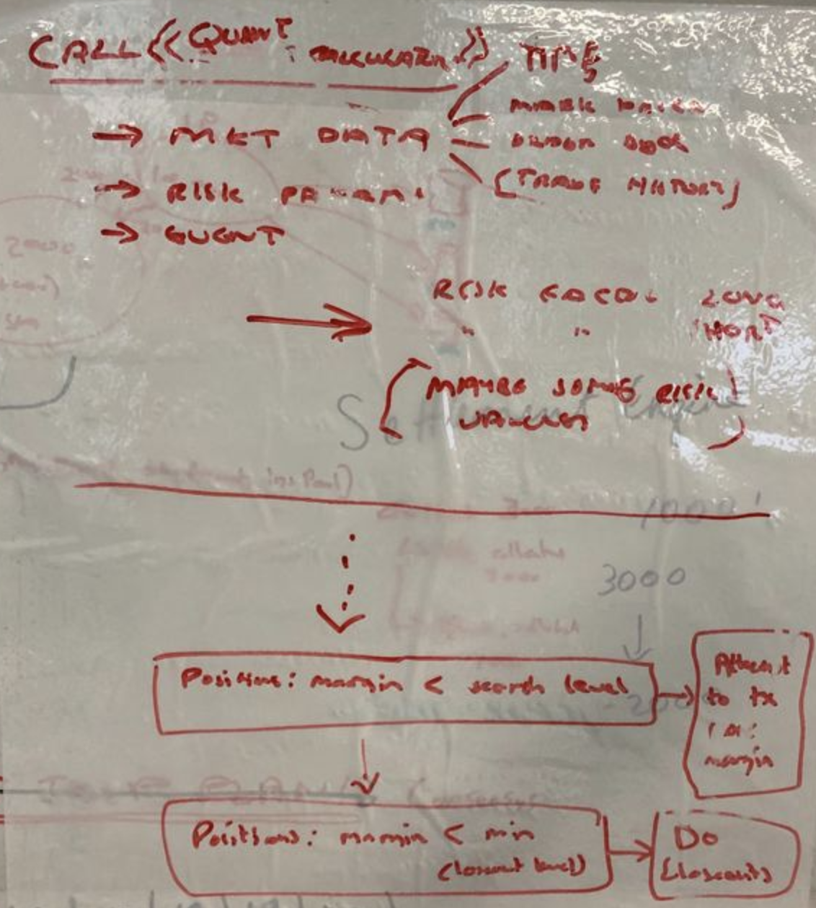
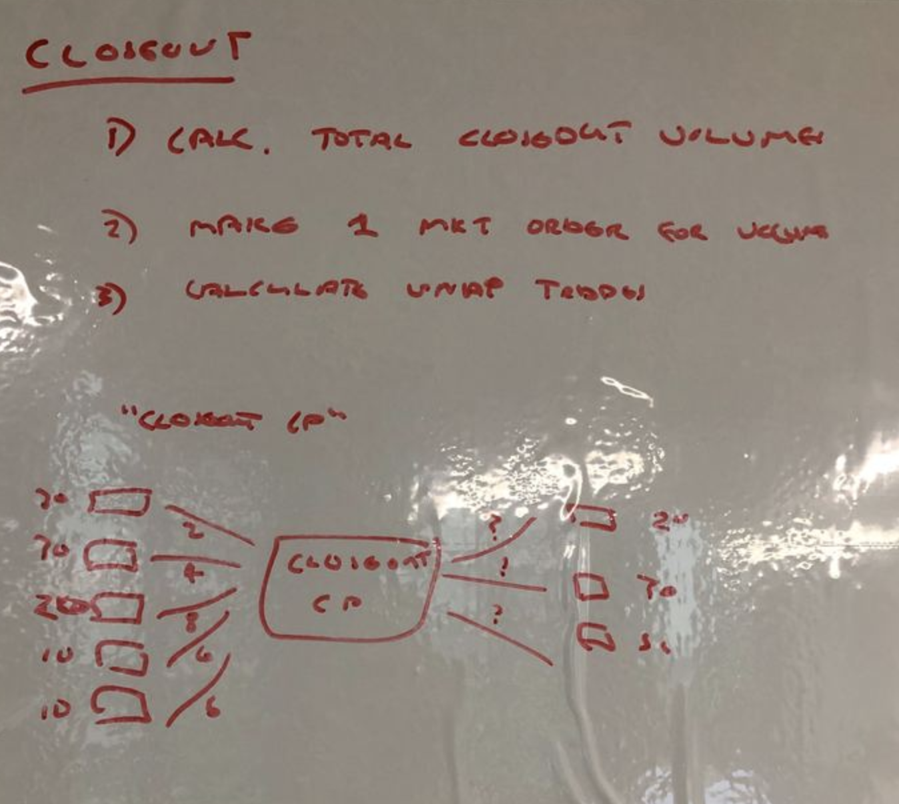

Feature name: risk and margin orchestration

Start date: YYYY-MM-DD

Specification PR: https://gitlab.com/vega-protocol/product/merge_requests

Product Gitlab ticket: 107

# Summary
This ticket encapsulates the orchestration of business logic which interfaces with the [quant risk suite](./0018-quant-risk-suite.md) to ensure that margin levels are calculated and utilised correctly in the protocol.

# Guide-level explanation
- Introducing new named concepts
- Explaining the features, providing some simple high level examples
- If applicable, provide migration guidance

# Reference-level explanation

## Orchestration

### Step 1 – calculate

Vega needs to evaluate after each market event (e.g. after processing each market instruction / transaction) whether or not any risk actions need to be performed. The outcome of this determination logic is either:
- NO ACTION

or

CALL QUANT RISK SUITE TO DO ONE OF THE FOLLOWING:
- UPDATE RISK FACTORS
- GET MARGIN LEVELS
(If UPDATE RISK FACTORS is done, UPDATE MARGIN LEVELS also needs to be done)

This can be determined based on the event details, which includes:
* The market instruction that was processed
* The set (possibly empty) of trades that were executed
* The set (possibly empty) of order book updates
* The market data

Action is UPDATE RISK FACTORS if: 
* A update risk factors call is not already in progress asynchronously; AND
* A specified period of time has elapsed (period can = 0 for always recalculate) for re-calculating risk factors (NB in Nicenet / for futures you can do this as often as you like since the calculation is dirt cheap and Edd is definitely not mean)

CALL UPDATE RISK FACTORS will also happen on creation of a new market that does not yet have risk factors, as any active market needs to have risk factors.

Action is GET MARGIN LEVELS if:
  * Market data has changed (recalculate ALL margins)
    * [FUTURE] Dependent market data can be specified by Product
    * [FUTURE] Change can be subject to a threshold
    * [NICENET] If orders on book change at all
    * [NICENET] If mark price changes
 * Positions have changed (recalculate margins for changed positions)
  * If already re-calculating all margins, don’t need to check for this
    * [NICENET] If a trader’s net open position changes
    * [NICENET] If either or both of a traders net potential long or short position (e.g. the sum of all buy order volume and sum of all sell order volume) has changed
    * [NICENET] Risk factors change (recalculate all margins)
    * [NICENET] The market is created

### Step 2 – evaluate
For all positions for a TRADER where the balance in the TRADER’s margin account for the market is less than the position’s collateral search level:
  * Attempt to transfer (traders_initial_margin - balance_of_traders_margin_account) from the trader’s main collateral account to their margin account
  * If the amount in the margin account is below the closeout level AFTER the collateral transfer request completes (whether successful or not) OR in an async (sharded) environment if the latest view of the trader’s available collateral suggests this will be the case, add the position to the list of positions for closeout.
  * Initiate [position resolution](./0012-position-resolution.md)

## Update to Margin Levels

Whenever positions, mark price, or risk factors change, the “not the risk engine” has to compile a list of traders with a margin balance that is less than the search balance. This data is sent to the collateral engine, which will attempt to top-up the margin account (taking funds from the market account, or general account if needed). The new margin balance should be the initial margin balance. If there’s not enough money available, we will top-up the account as much as possible. If the new balance is below the minimum margin, the trader is closed out.
Traders who have a balance > release level should have the excess margin released to their market account, to the point where their new margin level is the initial balance.

Needed to update margin levels:
* [NICENET] Add `Product.GetMarginLevels` to the product interface, returns a struct (type needs to be added)
* [NICENET] Add transfer types for collateral to know the amount that has to be moved from which account(s) to what other account.
* [FUTURE] Configurable “strategy” to determine to what level the margin balance needs to be updated

## Call Quant Risk Suite

We need a way for each market to calculate the risk factors for a market, this we have defined loosely as a `quant risk suite`. It contains the pre-built risk calculation functions that the trading core will use to calculate the risk levels for a given position and uses the risk model and risk parameters specified in the product specification for a market. These will be derived from the market framework.
 

## Closeout

Once it has been determined that close-outs need to occur (by the Orchestrator), [position resolution](./0012-position-resolution.md) kicks in.  

Position resolution is executed simultaneously for ALL traders on a market that have been determined to require it during a single event…. That is, the orchestrator ‘batches up’ the traders and runs [position resolution](./0012-position-resolution.md) once the full set of traders is known for this event. Sometimes that will only be for one trader, sometimes it will be for many.

There is a separate ticket for this since it contains duplicated functionality that the [settlement engine](./0002-settlement.md) may also use.

# Scenarios 
1. The mark price changes causing the trader’s margin to move into the search zone. A collateral search is initiated and the margin is topped back up above the search zone.
1. The mark price changes causing the trader’s margin to move into the search zone. A collateral search is initiated and the margin is topped back up to a level which results in the trader still being in the search zone. No further actions are taken.
1. The mark price changes causing the trader’s margin to move into the close-out zone. A collateral search is initiated and the margin is topped back up to the search zone. No further actions are taken.
1. The mark price changes causing the trader’s margin to move into the close-out zone. A collateral search is initiated and the margin is topped back up to a level which results in the trader still being in the close-out zone. This trader becomes a werewolf.
1. The mark price changes causing the trader’s margin to move in to the release level. Margin should be released back to the trader. 
1. On the market creation, the initial risk factors are created based on the market risk parameters