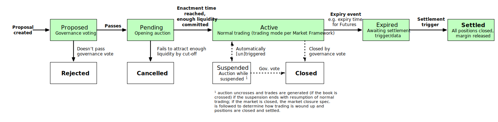

# Market Lifecycle

## Overview

### Market status

A market can progress through a number of states through its life. The overall market status flow is shown in the diagram below.

### Active markets

All markets have a "trading mode" (plus its coniguration) as part of the [market framework](0001-market-framework.md). When a market is Active (i.e. it is open for trading), it will be in a trading period. Normally, the trading period will be defined by the trading mode (additionally, this is one period for the life of the market once it opens, but in future, trading modes may specify a schedule of periods). When created, a market will generally start in an opening auction period. Markets can also enter exeptional periods of either defined or indefinite length as the result of triggers such as price or liquidity monitoring or a governance vote (this spec does not specify any triggers that should switch periods, only that it must be possible).

## Market status details

### Proposed

Markets created via governance proposals and voting will always begin in a proposed state. At this point governance is deciding whether the market should be created, and liquidity providers may also support the market proposal by committing liquidity.

**Entry:**

- Valid governance proposal (including sufficient liquidity committed ot meet the proposer minimum) submitted and accepted

**Exit:**

- Voting period ends

  - Passed (yes votes win & thresholds met) → Pending
  - Failed (no votes win or thresholds not met) → Pending

**Behaviour:**

- Participants can vote for or against the market
- Liquidity providers can make, change, or exit commitments (proposer can't commit below proposer minimum)
- No trading is possible, no orders can be placed (except the liquidity provider order/shape that forms part of their commitment)
- No market data (price, etc.) is emitted, no positions exist on the market, and no risk management occurs

### Pending

Once creation of a market is approved via a governance proposal, or (in future) when a market is scheduled to be created as part of a series of auto-generated markets, it is created with a Pending state and opens in an auction period ("opening auction"). A Pending market becomes an Active market when both the enactment date is reached and it has met the minimum liquidity commitment requirement. A market will be cancelled rather than becoming Active if the maximum time allowed (network param) to collect liquidity is excdeed, if the market reaches its expiry date (if applicable) whilst in a Pending state, or if it is closed via a governance vote whilst Pending.

**Entry:**

- Governance vote passed (yes votes win & thresholds met)
- [Future: Market creation is scheduled via a series]

**Exit:**

- Enactment date is reached and liquidity stake committed >= minimum required to leave price monitoring (target stake) → Active
- Expiry date is reached and liquidity stake committed < minimum required to leave price monitoring (target stake) → Cancelled
- Maximum time in Pending (a network parameter) is reached and liquidity stake committed < minimum required to leave price monitoring (target stake) → Cancelled
- Market change governance vote approves closure/cancellation of market → Cancelled

**Behaviour:**

- Liquidity providers can make, change, or exit commitments, but proposer cannot reduce commitment beolow minimum proposer commitment
- Orders can be placed into the auction, no trading occurs until the auction uncrosses, which happens at the time the market becomes Active. If the market is cancelled, the auction is never ucnrossed and no trading occurs at all.
- Only market data related to auctions (indicative uncrossing price/volume, etc.) are emitted, no positions exist on the market, and no risk management occurs
- The acution is extended past the enactment date if the liquidity provider stake committed does not meet the target stake

### Active

Once the enactment data is reached with sufficient committed liquidity to meet the target stake, the market becomes Active. This status indicates it is trading via it's normally configured trading mode according to the market framework (continuous trading, frequent batch auction, RFQ, block only, etc.). The specification for the trading mode should describe which orders are accepted and how trading proceeds. The market can become Expired via a product trigger (for futures, if the expiry date is reached) and can be temporarily suspended automatically by various monitoring systems (price monitoring, liquidity monitoring). The market can also be closed via a governance vote (market parameter update) to change the status to closed.

**Entry:**

- Enactment date reached
- Liquidity stake committed meets the minimum required to leave price monitoring (target stake)

**Exit:**

- Price, liquidity or other monitoring system triggers suspension → Suspended
- Expiry is triggered (futures: expiry date is reached) → Expired
- Market change governance vote approves closure of market → Closed

**Behaviour:**

- Liquidity providers can make, change, or exit commitments
- Orders can be placed into the auction, trading occurs according to normal trading mode rules
- Market data are emitted
- Positions and margins are managed as per the specs

### Expired

A market is expired when this status change is triggered by the product. In future this can be anything or it may never happen. For futures this trigger is based in a product parameter that sets the expiry timestamp. Expired markets accept no trading but retain the positions and margin balances that were in place after processing the expiry trigger (which may itself generate MTM cashflows, though for futures it doesn't). A market moves from expired to settled when enough information exists and the triggers are reached to settle the market. This could happen instantly upon reaching expired, though usually there will be a delay, for instance to wait for receipt and acceptance of data from a data source (oracle). An example of an instant transition would be where the trigger for expiry and the settlement are the publishing of a specific price from another market on the Vega network itself (same shard), as no buffer period is needed in this case to deal with issues related to time.

**Entry:**

- Triggered by product (i.e. expiry date for futures)

**Exit:**

- Settlement dependencies met (i.e. oracle data received) → Settled

**Behaviour:**

- No trading occurs, no orders are accepted
- Mark to market settlement is performed if required after expiry is triggered then never again
- No market data are emitted
- No risk management of price/liquidity monitoring occurs

### Settled

Once the required data to calculate the settlement cashflows is available for an Expired market, these cashflows are calcualted and applied to all traders with an open position (settlement). The positions are then closed and all orders cleared. All money held in margin accoutns after final settlement is returned to traders' general accounts. The market can be deleted entirely at this point, from a core perspective. Any insurance pool funds are distributed as per the insurance pool spec.

**Entry:**

- Market is Expired
- Triggered by product logic and inputs (i.e. required data source/oracle data is received)

**Exit:**

- No exit. End state.

**Behaviour:**

- No trading occurs, no orders are accepted
- All final settlement cashflows are calculated and applied (settled)
- Margins are trannsferred back to general accounts
- Insurance pool funds are redistributed
- Market is over and removed.

TODO: add the end states Rejected/Cancelled/Closed