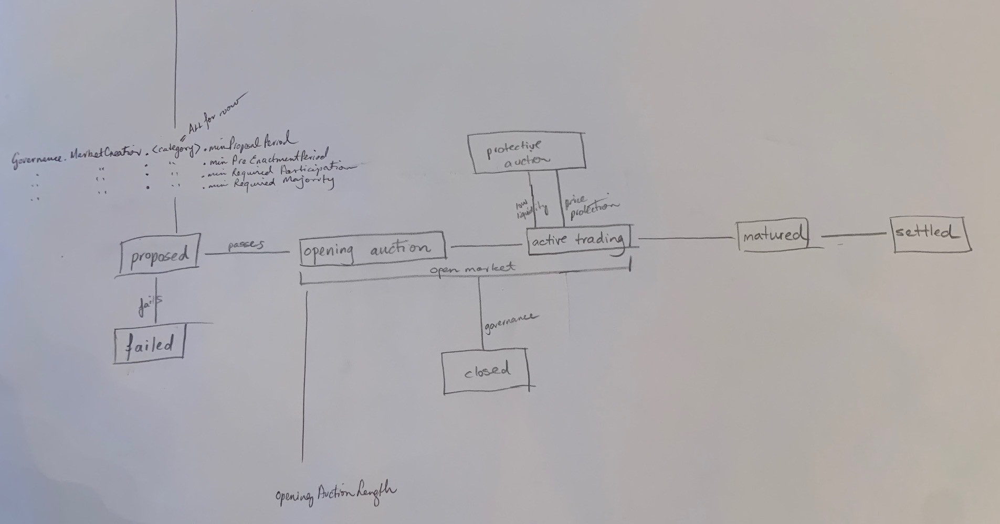

# Market Lifecycle

## Overview

Markets on Vega are permissionlessly proposed using the [governance mechanism](./0028-governance.md#1-create-market). If a market passes the governance vote, it undergoes various state changes throughout its lifecycle. Aspects of the state that change include:
- trading mode
- whether the market is open for trading
- status of settlement

## Market Creation

Markets proposed via [governance proposals](./0028-governance.md#1-create-market) undergo certain additional validations. 

1. [Future version] A "market creation" governance proposal should be rejected by the network if the proposer does not [also nominate to provide liquidity](./0044-lp-mechanics.md) on their proposed market (we will spec details of this at some point - not for MVP).

## Market lifecycle states

A market can progress through a number of states through its life. The overall market status flow is shown in the diagram below.

 

 
 
 

| State              | New LP | Trading    | Entry                 | Exit                                                  |
|--------------------|----------------|------------|-----------------------|-------------------------------------------------------|
|  Proposed          |   Yes          |  No        | Governance vote valid | Governance proposal period ends                       |
|  Rejected          |   Yes          |  No        | Governance vote fails/loses | N/A                                                   | 
|  Opening Auction   |   Yes          |  Yes       | Governance vote passes/wins  | Auction period ends                                   |
|  Active            |   Yes          |  Yes       | Auction period ends   | Governance vote (to close) OR maturity of market      |
|  Closed            |   Yes          |  No        | Governance vote by LP's (future version) | Governance vote by LP's (future version)    |
|  Matured           |   No           |  No        | Vega time > market-parameter        |      Settlement event commences     |
|  Settled at Expiry |   No           |  No        | Settlement event concludes       |      N/A      |

 
 
 

## Market state descriptions

### Proposed
All markets are first [proposed via the governance mechanism](./0028-governance.md#1-create-market). We can think of the market as being in a "proposed state", in the same way that any governance proposal is in a proposed state. At this point governance is deciding whether the market should be created.

**Entry:**

- Valid [governance proposal](./0028-governance.md#1-create-market) submitted and accepted

**Exit:**

- Voting period ends

  - Passed (yes votes win & thresholds met) → Opening Auction
  - Failed (no votes win or thresholds not met) → Rejected Market

**Behaviour:**

- Participants can vote for or against the market
- Liquidity providers can make, change, or exit commitments
- No trading is possible, no orders can be placed (except the liquidity provider order/shape that forms part of their commitment)
- No market data (price, etc.) is emitted, no positions exist on the market, and no risk management occurs

### Opening Auction

**Entry:**

- Valid [governance proposal](./0028-governance.md#1-create-market) passed (yes votes win & thresholds met)

**Exit:**

- Auction period ends when the enactment period has concluded, subject to the usual [ending of auction checks](./0026-auctions.md).

  - Opening auction period ends & checks pass → Active

**Behaviour:**

- Liquidity providers can make, change, or exit commitments
- Trading is possible as per [any regular auction period](./0026-auctions.md).
- Margins on orders as per auction based instructions in [margin calculator spec](./0019-margin-calculator.md).

### Active markets

All markets have a "trading mode" (plus its configuration) as part of the [market framework](0001-market-framework.md). When a market is Active (i.e. it is open for trading), it will be in a trading period. Normally, the trading period will be defined by the trading mode (additionally, this is one period for the life of the market once it opens, but in future, trading modes may specify a schedule of periods). When created, a market will generally start in an opening auction period. Markets can also enter exeptional periods of either defined or indefinite length as the result of triggers such as price or liquidity monitoring or a governance vote (this spec does not specify any triggers that should switch periods, only that it must be possible).

### Pending

Once creation of a market is approved via a governance proposal, or (in future) when a market is scheduled to be created as part of a series of auto-generated markets, it enters a pending state prior to being created. A Pending market becomes an Active market when both the enactment date is reached and it has met the minimum liquidity commitment requirement. A market will be cancelled before creation if the maximum time allowed (network param) to collect liquidity is excdeed, if the market reaches its expiry date (if applicable) whilst in a pending state, or via a governance vote.

**Entry:**

- Governance vote passed (yes votes win & thresholds met)
- [Future: Market creation is scheduled via a series]

**Exit:**

- Enactment date is reached and liquidity stake committed >= minimum required launch liquidity → Active
- Expiry date is reached and liquidity stake committed < minimum required launch liquidity → Cancelled
- Maximum time in Pending (a network parameter) is reached and liquidity stake committed < minimum required launch liquidity → Cancelled
- Market change governance vote approves closure/cancellation of market → Cancelled

**Behaviour:**

- Liquidity providers can make, change, or exit commitments
- No trading is possible, no orders can be placed (except the liquidity provider order/shape that forms part of their commitment)
- No market data (price, etc.) is emitted, no positions exist on the market, and no risk management occurs

### Problematic states and their resolutions

#### Insufficient liquidity to close out a trader
In the situation that there is insufficient liquidity to close out a trader, the market is put in to a [liquidity sourcing auction](./0026-auctions.md). This will be triggered by [liquidity monitoring](./0035-liquidity-monitoring.md).

The parameters for the auction will be as follows:
- Duration: ???

At the auction end, all positions are marked to market, and closeout trades will be created as usual.
